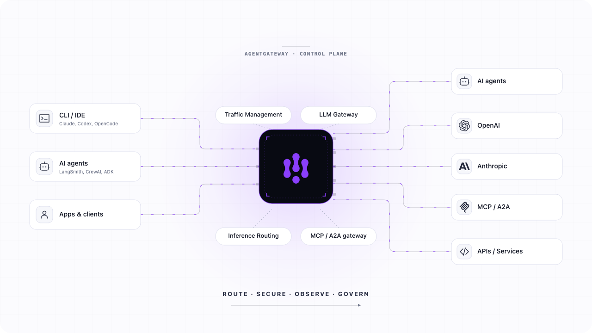

# [Agentgateway](https://agentgateway.dev/)

## Késako ?

An open source HTTP and gRPC gateway that handles traditional application traffic and AI-native protocols in one data plane. Route, secure, observe, and govern services, LLM provider traffic, MCP tools, and agent-to-agent communication without stitching together separate gateways.

Agentgateway is part of the Agentic AI Foundation (AAIF), hosted by the Linux Foundation, which also includes the Model Context Protocol (MCP).



## Install - Version 1.4

```bash
task ai:agentgateway:install

# Create a Gateway that uses the agentgateway GatewayClass
k apply -f ai/agentgateway/agentgateway-proxy.yml -n agentgateway-system
export INGRESS_GW_ADDRESS=$(kubectl get svc -n agentgateway-system agentgateway-proxy -o jsonpath="{.status.loadBalancer.ingress[0]['hostname','ip']}")
echo $INGRESS_GW_ADDRESS

# Replace "INGRESS_GW_ADDRESS" in mcp.json with the IP address obtained above
```

## Test

### [MCP Servers](https://agentgateway.dev/docs/kubernetes/latest/mcp/)

```bash
# Deploy k8s MCP Server
k apply -f ai/agentgateway/mcp

# Show Tools/Resources/Prompts via MCP Inspector (TUI)
task ai:mcp-inspector:start
```

### [Models Serving](https://agentgateway.dev/docs/kubernetes/latest/llm/)

```bash
# Install httpbun (he LLM-testing equivalent of httpbin)
k apply -f ai/agentgateway/models/httpbun.k8s.yml

# Create AgentgatewayModel for Model Serving via Gateway API
k apply -f ai/agentgateway/models/gpt-4.agentgatewaymodel.yml

# List available models
curl -s http://$INGRESS_GW_ADDRESS/v1/models
# {"data":[{"id":"gpt-4","object":"model","created":1785610753,"owned_by":"openai"}],"object":"list"}

# Request for model
curl -X POST http://$INGRESS_GW_ADDRESS/v1/chat/completions \
  -H "Content-Type: application/json" \
  -d '{
    "model": "gpt-4",
    "messages": [{"role": "user", "content": "Hello!"}],
    "httpbun": {"content": "Hello from the mock LLM"}
  }'
# {"model":"gpt-4","usage":{"prompt_tokens":4,"completion_tokens":6,"total_tokens":10},"choices":[{"message":{"content":"Hello from the mock LLM","role":"assistant"},"finish_reason":"stop","index":0}],"created":1785611907,"id":"chatcmpl-d2b292deca1840fc2d81add5","object":"chat.completion"}
```

It is also possible to use models hosted by third-party providers (OpenAI, Anthropic, etc.).

In my example below, I will instead use a model available via the OpenRouter interface

```bash
# Create OpenRouter Secret witch OPENROUTER_API_KEY
k create secret generic openrouter-secret --from-literal=Authorization=<OPENROUTER_API_KEY> -n agentgateway-system

# Create Agentgatewaymodels
k apply -f ai/agentgateway/models/openrouter-models.agentgatewaymodel.yml
```

## Alternatives

- [LiteLLM](https://www.litellm.ai/)
