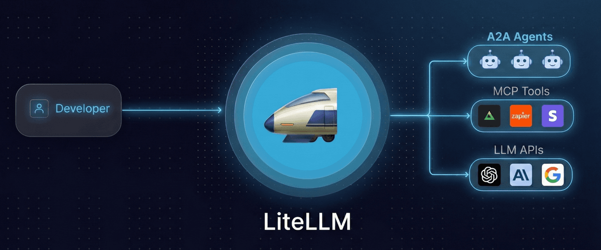

# [LiteLLM](https://www.litellm.ai/)

## Késako ?

LiteLLM is a unified gateway for LLMs, agents, and MCP — you don't need a separate agent or MCP gateway. One endpoint for 100+ models, A2A agents, and MCP tools.



## Install - version 1.95.1

```bash
task ai:litellm:install

# Get credentials
task ai:litellm:get-credentials
```

Open LiteLLM UI : http://litellm.127.0.0.1.nip.io/
