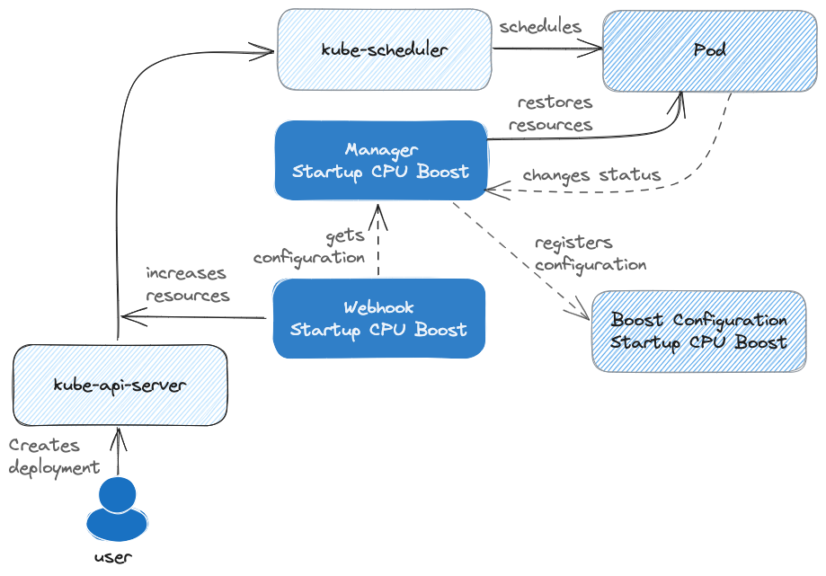

# [In-Place Resource Resize - v1.27 [alpha]][in-place-resource-resize-blog]

🏷️ **v1.35 [GA]**

## Késako ?

In-place resize allows operators to **dynamically modify** the CPU and memory resources of a **running pod** **without causing scheduling interruptions or downtime during the resizing process**. **This therefore allows a `kubectl patch ...` to be made on the `resources` of a deployment**

Instead of manually patching (`kubectl patch ...`), we can use the Kubernetes operator [Kube Startup CPU Boost
][kube-startup-cpu-boost-gh].

**Kube Startup CPU Boost** is a controller that increases CPU resource requests and limits during Kubernetes workload startup time. Once the workload is up and running, the resources are set back to their original values.



## Install *Kube Startup CPU Boost*

```bash
task kube-startup-cpu-boost-install
```

## Test with Java Application

Java applications often require varying resources at different stages. During startup, the JVM typically demands more resources due to the heavy compute load involved in initial class loading and optimization. Once the application is running, resource requirements generally decrease. Since the JVM utilizes multi-threading, providing additional CPU resources can significantly speed up startup times.

### Without *Kube Startup CPU Boost*

```bash
kubectl apply -f discovery/in-place-resource-resize-1.27-alpha/spring-demo.deploy.yml

## Show Logs
kubectl logs deploy/spring-demo-app | grep "Started DemoApplication"
### ... Started DemoApplication in 90.322 seconds (process running for 100.79)
```

### *Kube Startup CPU Boost* in Action

```bash
kubectl delete -f discovery/in-place-resource-resize-1.27-alpha/spring-demo.deploy.yml

## Deploy Startup CPU Boost
## Increase container CPU requests and limits by 100% (to 2 cores) until the Pod reaches Ready condition.
kubectl apply -f discovery/in-place-resource-resize-1.27-alpha/startup-cpu-boost.yml

kubectl apply -f discovery/in-place-resource-resize-1.27-alpha/spring-demo.deploy.yml

## Show Logs
kubectl logs deploy/spring-demo-app | grep "Started DemoApplication"
### ... Started DemoApplication in 39.925 seconds (process running for 100.79)
```

## Resources

- [Faster startup times for Kubernetes workloads with Kube Startup CPU Boost][understanding-kubernetes-dynamic-resource-scaling-and-cpu-boost]
- [Warm up the relationship between Java and Kubernetes][understanding-kubernetes-dynamic-resource-scaling-and-cpu-boost]

<!-- Links -->
[in-place-resource-resize-blog]: https://kubernetes.io/blog/2023/05/12/in-place-pod-resize-alpha/
[understanding-kubernetes-dynamic-resource-scaling-and-cpu-boost]: https://cloud.google.com/blog/products/containers-kubernetes/understanding-kubernetes-dynamic-resource-scaling-and-cpu-boost?hl=en
[kube-startup-cpu-boost-gh]: https://github.com/google/kube-startup-cpu-boost
