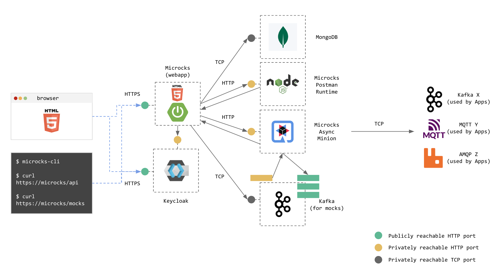

# [Microcks][microcks.io]

## Késako ?

The open source, cloud native tool for API Mocking and Testing.



## Install

```bash
task discovery:microcks-install
```

> ⚠️ Start opening <https://keycloak.127.0.0.1.nip.io> in your browser to validate the self-signed certificate. Once done, you can visit <https://microcks.127.0.0.1.nip.io> in your browser, validate the self-signed certificate and start playing around with Microcks!
>
> The default user/password is ***admin/microcks123***

## Test

Please follow the instructions below to use Microcks :

- [Getting started / Using Microcks][microcks-getting-started]
- [Getting started with Tests][microcks-getting-started-tests]
  - Deploying **Pastry Api** : `docker run -i --rm -p 8282:8282 quay.io/microcks/quarkus-api-pastry:latest`
  - Use this URL as a Test Endpoint : <http://host.docker.internal:8282>
  - We can also use the Microcks CLI to run Contract Tests

    ```bash
    docker run --net host -it quay.io/microcks/microcks-cli:latest microcks-cli test \
      'API Pastry - 2.0:2.0.0' http://host.docker.internal:8282 OPEN_API_SCHEMA \
      --microcksURL=https://microcks.127.0.0.1.nip.io/api/ \
      --keycloakClientId=microcks-serviceaccount \
      --keycloakClientSecret=ab54d329-e435-41ae-a900-ec6b3fe15c54 \
      --operationsHeaders='{"globals": []}' \
      --insecure --waitFor=10sec
    ```

## Uninstall

```bash
task discovery:microcks-uninstall
```

## Resources

- [Deployment topologies][microcks-deploy-topologies]
- [Architecture & deployment options][microcks-architecture]

<!-- Links -->
[microcks.io]: https://microcks.io/
[microcks-deploy-topologies]: https://microcks.io/documentation/explanations/deployment-topologies/
[microcks-architecture]: https://microcks.io/documentation/explanations/deployment-options/
[microcks-getting-started]: https://microcks.io/documentation/tutorials/getting-started/
[microcks-getting-started-tests]: https://microcks.io/documentation/tutorials/getting-started-tests/
