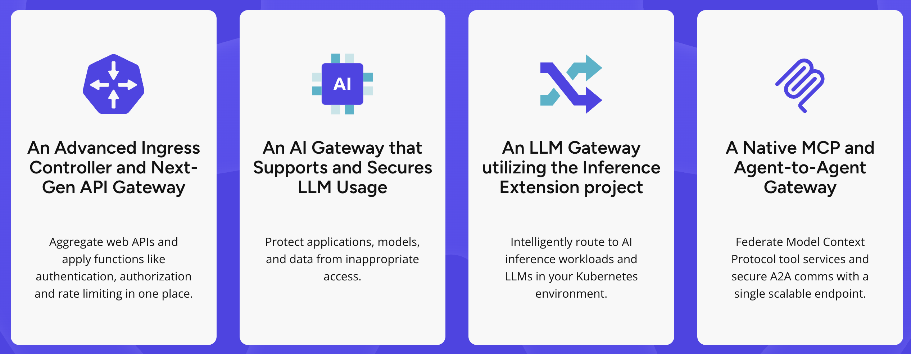

# [KGateway](https://kgateway.dev/)

## Késako ?

kgateway is the most mature and widely deployed Envoy-based gateway in the market today. Built on open source and open standards, kgateway implements the Kubernetes Gateway API with a control plane that scales from lightweight microgateway deployments between services, to massively parallel centralized gateways handling billions of API calls, to advanced AI gateway use cases for safety, security, and governance when serving models or integrating applications with third-party LLMs. kgateway brings omni-directional API connectivity to any cloud and any environment.



## Install

```bash
task gateway:kgateway-install
```

## Test

For our tests, we're going to take advantage of the Gateway API Inference Extension to deploy vLLM-based Model Serving.

1. Deploy Sample Model Server (vLLM based) - [vLLM Simulator Model Server](https://github.com/llm-d/llm-d-inference-sim/tree/main)

```bash
kubectl apply -f gateway/kgateway/vllm-simulator.deploy.yml
```

2. Deploy [InferenceModel and InferencePool](https://gateway-api-inference-extension.sigs.k8s.io/concepts/api-overview/#api-overview)

```bash
# Inference Model
kubectl apply -f gateway/kgateway/inferencemodels.yml

# InferencePool
kubectl apply -f gateway/kgateway/llama3-8b-instruct.inferencepool.yml
```

3. Deploy Inference Gateway

```bash
# Deploy Gateway
kubectl apply -f gateway/kgateway/inference.gateway.yml

# Deploy HTTPRoute
kubectl apply -f gateway/kgateway/inference.routes.yml
```

All wired up, now it's time to test :

```bash
IP=$(kubectl get gateway/inference-gateway -o jsonpath='{.status.addresses[0].value}')
PORT=80

curl -i ${IP}:${PORT}/v1/completions -H 'Content-Type: application/json' -d '{
"model": "meta-llama/Llama-3.1-8B-Instruct",
"prompt": "Write as if you were a critic: San Francisco",
"max_tokens": 100,
"temperature": 0
}'

# HTTP/1.1 200 OK
# x-envoy-upstream-service-time: 0
# x-went-into-resp-headers: true
# server: envoy
# date: Sun, 15 Jun 2025 15:41:17 GMT
# content-type: application/json
# transfer-encoding: chunked

# {"choices":[{"finish_reason":"stop","index":0,"text":"Testing, testing 1,2,3."}],"created":1750002077,"id":"chatcmpl-1bfc53ab-07d4-4107-8590-0e9a16ba9c02","model":"meta-llama/Llama-3.1-8B-Instruct","usage":{"completion_tokens":3,"prompt_tokens":9,"total_tokens":12}}
```

## Uninstall

```bash
task gateway:kgateway-uninstall
```

## Resources

- [Deep Dive into the Gateway API Inference Extension](https://kgateway.dev/blog/deep-dive-inference-extensions/)
