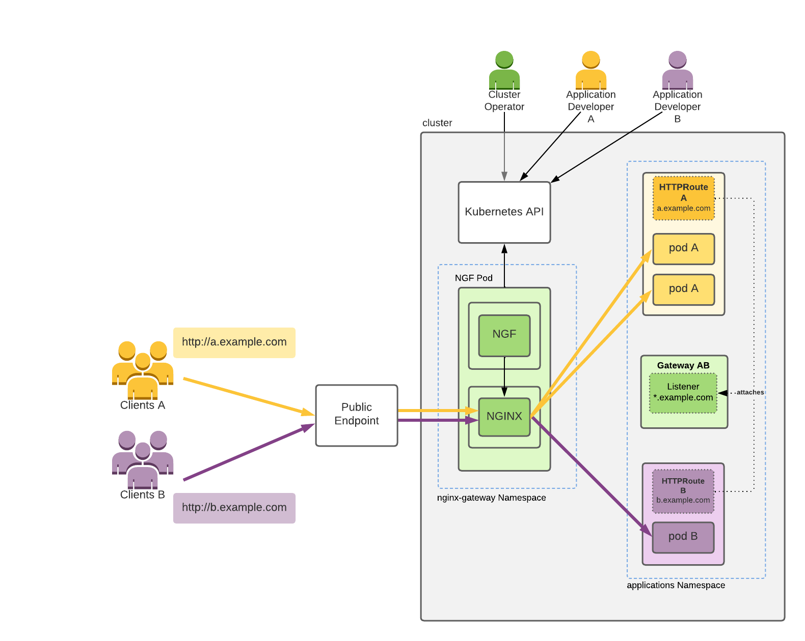

# [Nginx Gateway Frabric][nginx-gateway-fabric-doc]

## Késako ?

NGINX Gateway Fabric is an open source project that provides an implementation of the Gateway API using NGINX as the data plane. The goal of this project is to implement the core Gateway APIs – Gateway, GatewayClass, HTTPRoute, GRPCRoute, TCPRoute, TLSRoute, and UDPRoute – to configure an HTTP or TCP/UDP load balancer, reverse proxy, or API gateway for applications running on Kubernetes. NGINX Gateway Fabric supports a subset of the Gateway API.



## Install

```bash
## Install CRD and Implementation (Nginx Gateway Fabric) of Kubernetes Gateway API -  By Cluster Operator
task gateway:nginx-install
```

> ℹ️ When Nginx Gateway Fabric is installed, a **GatewayClass** `nginx` is provisioned for us.
> To show it : `kubectl describe gc/nginx`

## Test

### Hello World 👋🏼

```bash
## Deploy Workload - By Application Developer
kubectl apply -f gateway/nginx/coffee.workload.yml

## Deploy Gateway - By Cluster Operator
kubectl apply -f gateway/nginx/coffee.gateway.yml

## Deploy Routes HTTP - By Application Developer
kubectl apply -f gateway/nginx/coffee.routes.yml

## Call API - /coffee
curl --connect-to coffee.nzuguem.me:80:localhost:9080 http://coffee.nzuguem.me/coffee
## or
curl -H "Host: coffee.nzuguem.me" localhost:9080/coffee

## Call API - /tea
curl --connect-to coffee.nzuguem.me:80:localhost:9080 http://coffee.nzuguem.me/tea
## or
curl -H "Host: coffee.nzuguem.me" localhost:9080/tea
## or HTTPS
curl --connect-to coffee.nzuguem.me:443:localhost:9443 https://coffee.nzuguem.me/tea -k
```

> ℹ️ Using the `--connect-to` option with curl is closely related to the `--resolve` option. This command instructs `curl` to resolve the domain name in the URL by replacing it with the specified one. In the case of an HTTPS request, this option also sends the `SNI` (*the domain name specified in the URL*). The use of the `Host` header will also work, but only for unencrypted requests, as in the case of HTTPS requests, this header will not be considered as SNI (Cf. [Name resolve tricks][curl-name-resolve-tricks])

### Advanced Routing

```bash
## Deploy All Resources
kubectl apply -f gateway/nginx/advanced/routing

## Curl to "coffee-v1-svc"
curl --connect-to cafe.nzuguem.me:80:localhost:9080 http://cafe.nzuguem.me/coffee

## Curl to "coffee-v2-svc"
curl --connect-to cafe.nzuguem.me:80:localhost:9080 http://cafe.nzuguem.me/coffee -H "version:v2"
curl --connect-to cafe.nzuguem.me:80:localhost:9080 http://cafe.nzuguem.me/coffee?TEST=v2

## Curl to "tea-post-svc"
curl --connect-to cafe.nzuguem.me:80:localhost:9080 http://cafe.nzuguem.me/tea -X POST

## Curl to "tea-svc"
curl --connect-to cafe.nzuguem.me:80:localhost:9080 http://cafe.nzuguem.me/tea
```

### GRPC

```bash

## Deploy Workload
kubectl apply -f gateway/nginx/advanced/grpc/helloworld.yml
```

#### Exact method matching based routing

```bash
kubectl apply -f gateway/nginx/advanced/grpc/exact-method.yml

grpcurl -plaintext -proto gateway/nginx/advanced/grpc/grpc.proto -d '{"name": "GRPC"}' localhost:9080 helloworld.Greeter/SayHello
```

#### Hostname based routing

```bash
kubectl delete -f gateway/nginx/advanced/grpc/exact-method.yml

kubectl apply -f gateway/nginx/advanced/grpc/hostname.yml

# Test bar hostname
grpcurl -plaintext -proto gateway/nginx/advanced/grpc/grpc.proto -authority bar.nzuguem.me -d '{"name": "bar server"}' localhost:9080 helloworld.Greeter/SayHello

# Test foo-bar hostname
grpcurl -plaintext -proto gateway/nginx/advanced/grpc/grpc.proto -authority foo-bar.nzuguem.me -d '{"name": "foo-bar server"}' localhost:9080 helloworld.Greeter/SayHello
```

#### Headers based routing

```bash
kubectl delete -f gateway/nginx/advanced/grpc/hostname.yml

kubectl apply -f gateway/nginx/advanced/grpc/headers.yml

# Test Version One
grpcurl -plaintext -proto gateway/nginx/advanced/grpc/grpc.proto -d '{"name": "version one"}' -H 'version: one' localhost:9080 helloworld.Greeter/SayHello

# Test Version Two
grpcurl -plaintext -proto gateway/nginx/advanced/grpc/grpc.proto -d '{"name": "version two"}' -H 'version: two' localhost:9080 helloworld.Greeter/SayHello

# Test Version Two And Color Orange
grpcurl -plaintext -proto gateway/nginx/advanced/grpc/grpc.proto -d '{"name": "version two color orange"}' -H 'version: two' -H 'color: orange' localhost:9080 helloworld.Greeter/SayHello
```

## Uninstall

```bash
task gateway:nginx-uninstall
```
<!-- Links -->
[nginx-gateway-fabric-doc]: https://docs.nginx.com/nginx-gateway-fabric/
[curl-name-resolve-tricks]: https://everything.curl.dev/usingcurl/connections/name.html
