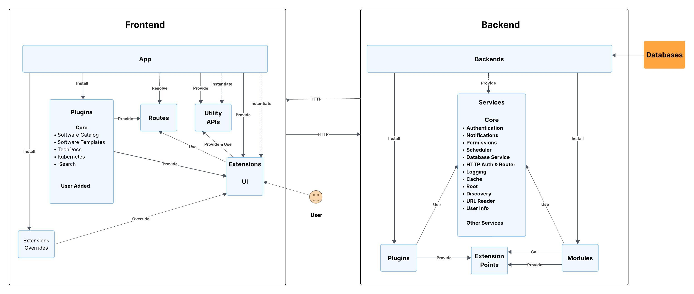
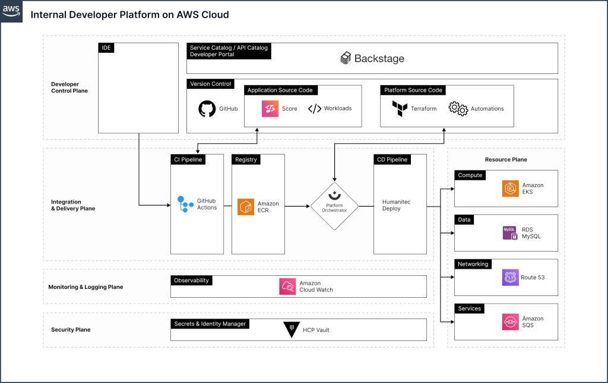

# [Backstage](https://backstage.io/)

## Késako ?

An open source framework for building developer portals

Powered by a centralized software catalog, Backstage restores order to your infrastructure and enables your product teams to ship high-quality code quickly — without compromising autonomy.

[](https://backstage.io/docs/overview/architecture-overview/)

Backstage is part of the Developer Control Plane section of the [Internal Developer Portal](https://internaldeveloperplatform.org/).



## Install

```bash
task idp:backstage:install
```

Visit <http://backstage.127.0.0.1.nip.io:9080>

## Resources

- [Comment créer un plug-in avec Spotify Backstage pour votre Internal Developer Platform ? - Démo live](https://www.youtube.com/watch?v=3Rs7syQP744)
- [Getting Started with Backstage](https://piotrminkowski.com/2024/06/13/getting-started-with-backstage/)
- [Backstage on Kubernetes](https://piotrminkowski.com/2024/06/28/backstage-on-kubernetes/)
