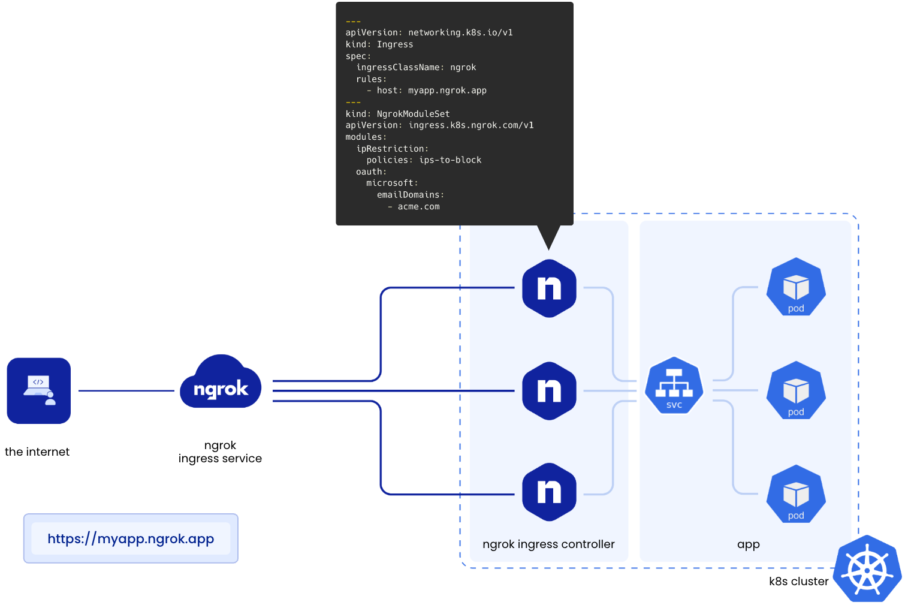

# Ingress - [Ngrok Controller][ngrok-ingress-k8s-doc]

## Késako ?

The ngrok Ingress Controller adds secure internet access to Kubernetes workloads by offloading network ingress and middleware execution to ngrok's global points of presence.



## Install

[Create an account][ngrok-service-singup] with the Ngrok service and obtain identification information (**Add these informations to the `.env` file at the root of this project**) :
- `NGROK_API_KEY`
- `NGROK_AUTHTOKEN`

```bash
task ingress:ngrok-install
```

## Test

> ℹ️ From your Ngrok dashboard, create an [Edge domain][ngrok-dashboard-edge-domain]. Set it in `.env` file (e.g: `NGROK_EDGE_HOST_DOMAIN=evolved-pheasant-modern.ngrok-free.app`)

```bash
## Deploy the popular 2048 game
cat ingress/ngrok/game-2048.yml | envsubst | kubectl apply -f -
```

Visit this URL : `https://<NGROK_EDGE_HOST_DOMAIN>`

## Uninstall

```bash
kubectl delete -f ingress/ngrok/game-2048.yml

task ingress:ngrok-uninstall
```

## Resources

- [Using ngrok with Kubernetes][ngrok-using-with-k8s]

<!-- Links -->
[ngrok-ingress-k8s-doc]: https://ngrok.com/blog-post/ngrok-k8s
[ngrok-service-singup]: https://dashboard.ngrok.com/signup
[ngrok-dashboard-edge-domain]: https://dashboard.ngrok.com/cloud-edge/edges
[ngrok-using-with-k8s]: https://ngrok.com/docs/using-ngrok-with/k8s/