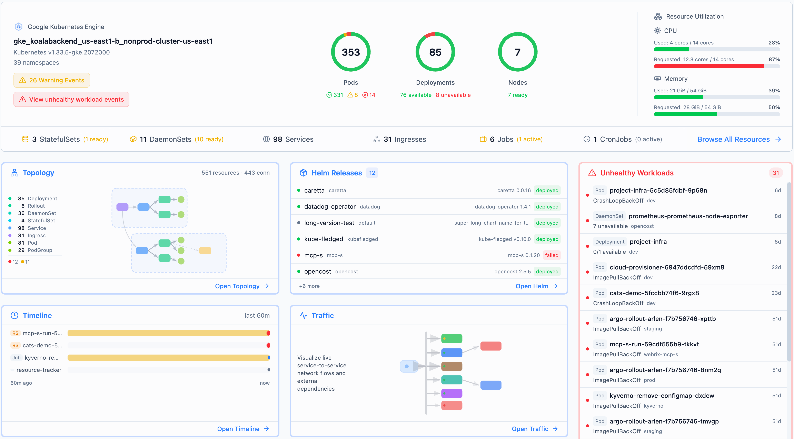

# [Radar](https://github.com/skyhook-io/radar)

## Késako

Modern Kubernetes visibility. Topology, event timeline, and service traffic — plus resource browsing and Helm management.



## Install

### In Cluster

```bash
# In Cluster
task k8s-ui:install:radar:in-cluster
```

Visit http://radar.127.0.0.1.nip.io

### In Local

```bash
# In local
task k8s-ui:install:radar:in-local
```

Visit http://localhost:9280
