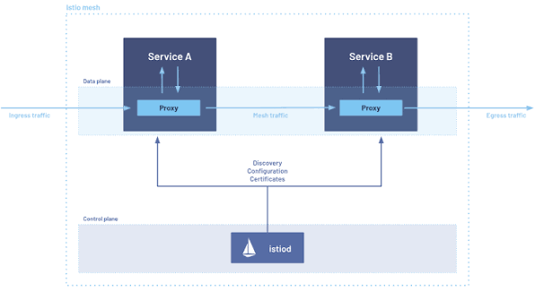
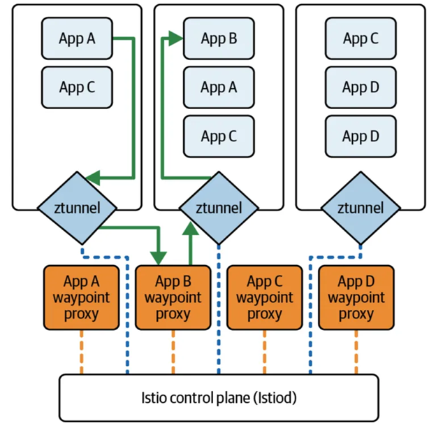

# [Istio](https://istio.io/)

## Késako ?

[**Service Mesh** ](https://www.redhat.com/fr/topics/microservices/what-is-a-service-mesh):  A Service Mesh is an **infrastructure layer** included in a software application that manages communication between different services. It takes care of traffic routing, security, observability and resilience functions, thus preventing them from being integrated into each individual service.

Istio is a service mesh.

Several operating modes :

- **Sidecar mode**: Istio has been built on the sidecar pattern from its first release in 2017. Sidecar mode is well understood and thoroughly battle-tested, but comes with a resource cost and operational overhead.



- **Ambient mode**: Launched in 2022, ambient mode was built to address the shortcomings reported by users of sidecar mode.



> ℹ️ Note that in order to enable ztunnel interception, all that is required is the **istio.io/dataplane-mode: ambient** label on the workload namespace.

### Addons

The entire Istio infrastructure layer is deployed in GitOps mode via ArgoCD when the cluster is started.

To install the add-ons to get some extra features:

```bash
task mesh:istio:install:addons
```

## Tests
If you need a browser to access the deployed applications :
```bash
task start:firefox
# https://localhost:3001
```


- [Kiali](https://kiali.io/) : http://kiali.127.0.0.1.nip.io/kiali
- Grafana : http://grafana-istio.127.0.0.1.nip.io/


