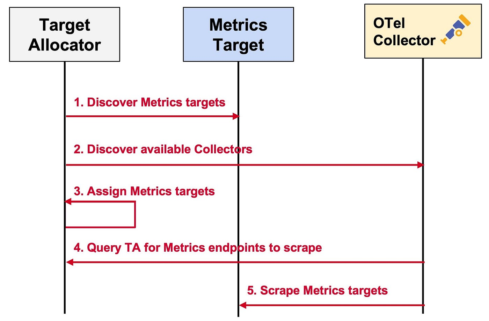
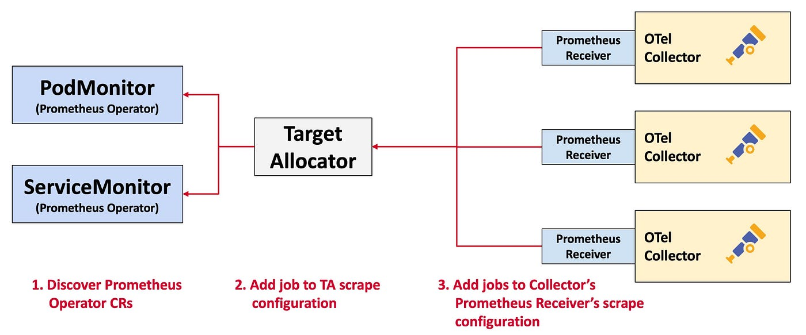

# Observability - OpenTelemetry

## Install
```bash
task observability:opentelemetry-install
```

## Test

### Create OTel Collector
```bash
kubectl apply -f observability/otel/otelcol.sidecar.yml

## Get All OTel Collectors in Cluster
kubectl get otelcol,svc
```

> ℹ️ The OpenTelemetry operator analyzes the recievers and their ports in the configuration and creates corresponding services (standard and headless).

### Injecting the sidecar on a kubernetes workload
```bash
## This workload uses the OpenTracing SDK to push traces to Jeager
kubectl apply -f observability/otel/jaegertracing.deploy.yml

## Observe the injected sidecar
kubectl get pods -l app=jaegertracing -o jsonpath={.items[*].spec.containers[*].name}

## Follow and Observe Logs of Injected OTel Collector
kubectl logs deploy/jaegertracing -c otc-container -f
```

Visit this URL to generate telemetry http://jaegertracing.127.0.0.1.nip.io

### Workload Auto-Instrumentation
```bash
kubectl apply -f observability/otel/otel.inst.yml

## Get All OTel Instrumentation in Cluster
kubectl get otelinst

## Deploy OTel Collector as Deployment
kubectl apply -f observability/otel/otelcol.deployment.yml

## Deploy Instrumented Workload
kubectl apply -f observability/otel/hello.deploy.yml

## Follow and Observe Logs of Injected OTel Collector
kubectl logs deploy/collector-deployment-collector -f
```

Visit this URL to generate Traces http://hello.127.0.0.1.nip.io/hello/Kevin


### Deploy OTel Collector as DaemonSet

```bash
## It displays the logs of the jaegertracing workload in debug mode.
kubectl apply -f observability/otel/otelcol.daemonset.yml

## Get logs
kubectl logs -l app.kubernetes.io/instance=default.collector-daemonset -f
```

Visit this URL to generate Logs http://jaegertracing.127.0.0.1.nip.io

### Focus on the [Target Allocator][otel-target-allocator-gh] component

In a nutshell, the TA is a mechanism for decoupling the service discovery and metric collection functions of Prometheus such that they can be scaled independently. The TA manages the configuration of the Collector's [Prometheus Receiver][otel-prom-reciever-gh].

> ⚠️ The TargetAllocator currently supports the ***statefulset*** and ***daemonset*** deployment modes of the OpenTelemetryCollector CR.

The TA serves two functions:

- Even distribution of Prometheus targets among a pool of Collectors (*OTel Collector CR*)



- Discovery of Prometheus CR (*PodMonitor and Service Monitor*)



```bash
## Deploy OTel Collector as StatefulSet
kubectl apply -f observability/otel/otelcol-ta.statefulset.yml

## Check that the collector is working
kubectl logs po/collector-statefulset-collector-0 -f

# 2024-05-19T09:17:12.183Z        info    MetricsExporter {"kind": "exporter", "data_type": "metrics", "name": "debug", "resource metrics": 1, "metrics": 15, "data points": 15}
# 2024-05-19T09:17:22.181Z        info    MetricsExporter {"kind": "exporter", "data_type": "metrics", "name": "debug", "resource metrics": 1, "metrics": 15, "data points": 15}
```

OTel Operator will rewrite the OTel Collector configuration (*Prometheus Receiver*), to inject `target_allocator` (it works exactly like the [Prometheus Discovery Service `http_sd_config`][prom-http-sd-config-doc]). And all Prometheus job configurations will be reflected in the TA configuration (**The TA is itself a deployment k8s generated by OTel Operateur**).

```bash
## Verify final collector configuration
kubectl describe cm/collector-statefulset-collector

# ...
# receivers:
#     prometheus:
#         config: {}
#         target_allocator:
#             collector_id: ${POD_NAME}
#             endpoint: http://collector-statefulset-targetallocator:80
#             interval: 30s
# ...

## Verify TA configuration
kubectl describe cm/collector-statefulset-targetallocator 

# ...
# config:
#   scrape_configs:
#   - job_name: otel-collector
#     scrape_interval: 10s
#     static_configs:
#     - targets:
#       - 0.0.0.0:8888
# ...
```

> ℹ️ The TA component exposes a [Rest API][otel-target-allocator-endpoints] for consulting its configurations and actions

Let's try scaling OTel Collector and observe the power of the TA component:

```bash
## Scale of OTel Collector
kubectl scale otelcol/collector-statefulset --replicas 3

## Consult TA actions
for i in {1..3}; do curl http://otel-ta.127.0.0.1.nip.io/jobs/otel-collector/targets | jq .; done
```

You'll see that the TA has assigned the Job to a single OTel Collector. Depending on your workload, you can choose a particular [allocation strategy][otel-target-allocator-strategy] by the TA.

## Uninstall
```bash
kubectl delete -f observability/otel/otelcol.sidecar.yml
kubectl delete -f observability/otel/jaegertracing.deploy.yml
kubectl delete -f observability/otel/otel.inst.yml
kubectl delete -f observability/otel/otelcol.deployment.yml
kubectl delete -f observability/otel/hello.deploy.yml
kubectl delete -f observability/otel/otelcol.daemonset.yml

kubectl delete -f observability/otel/otelcol-ta.statefulset.yml

task observability:opentelemetry-uninstall
```

## Resources
- [OpenTelemetry Operator][otel-operator-gh]

<!-- Links -->
[otel-operator-gh]: https://github.com/open-telemetry/opentelemetry-operator
[otel-target-allocator-gh]: https://github.com/open-telemetry/opentelemetry-operator/blob/main/cmd/otel-allocator/README.md
[otel-prom-reciever-gh]: https://github.com/open-telemetry/opentelemetry-collector-contrib/blob/main/receiver/prometheusreceiver/README.md
[prom-http-sd-config-doc]: https://docs.victoriametrics.com/sd_configs/#http_sd_configs
[otel-target-allocator-endpoints]: https://github.com/open-telemetry/opentelemetry-operator/blob/main/cmd/otel-allocator/README.md#endpoints
[otel-target-allocator-strategy]: https://github.com/open-telemetry/opentelemetry-operator/blob/main/cmd/otel-allocator/README.md#allocation-strategies