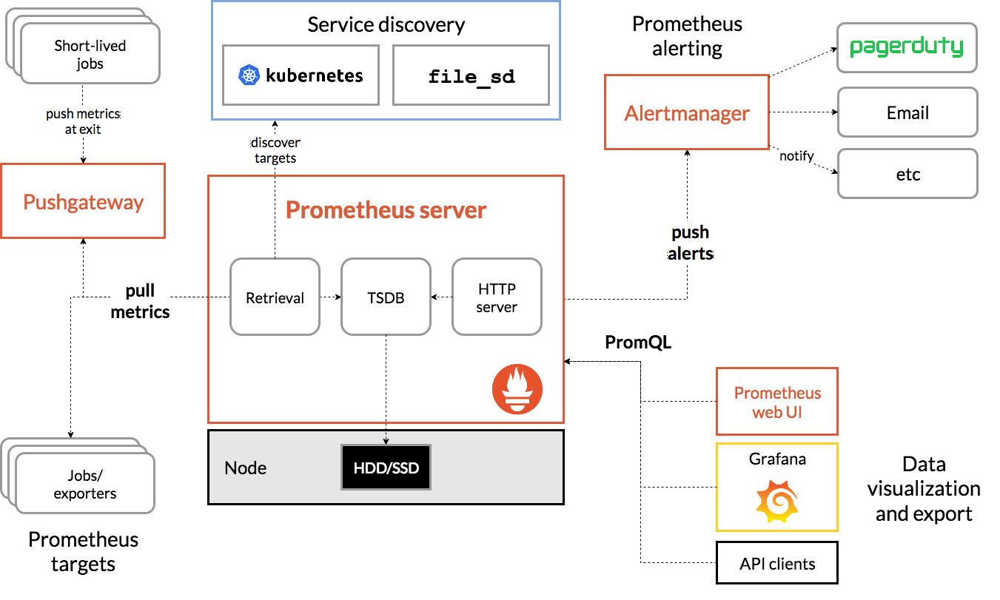

# Observability - Prometheus

## Késako ?

Prometheus is a popular open-source monitoring and alerting solution, and has over time become an indispensable tool for managing and observing Kubernetes clusters.



## Install

```bash
task observability:prometheus-install

## Get Grafana credentials
task observability:grafana-get-credentials
```

Grafana : <http://grafana.127.0.0.1.nip.io>

Prometheus Dashboard : <http://prometheus.127.0.0.1.nip.io>

Alert Manager Dashboard : <http://alert-manager.127.0.0.1.nip.io>

## Uninstall

```bash
task observability:prometheus-uninstall
```

## Resources

- [Prometheus Operator Doc][prometheus-operator-doc]
- [Prometheus Operator Helm Chart][prometheus-operator-helm-gh]
- [Prometheus de A à Z - Youtube][prometheus-a-à-z-yt]

<!-- Links -->
[prometheus-operator-doc]: https://prometheus-operator.dev/
[prometheus-operator-helm-gh]: https://github.com/prometheus-community/helm-charts/tree/main/charts/kube-prometheus-stack
[prometheus-a-à-z-yt]: https://youtu.be/ExG-5rBCYrU?si=W7bSCWtUDGqc99hZ
