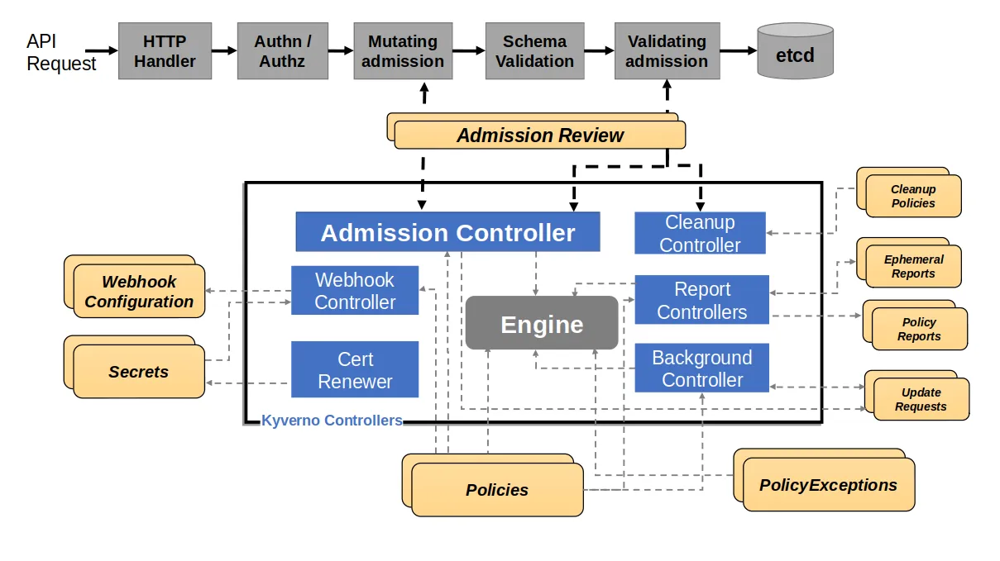

# [Kyverno](https://kyverno.io/)

## Késako ?
Kyverno is a Kubernetes-native policy engine that operates directly within the control plane as a validating and mutating admission webhook. Unlike older tools that require learning specialized policy languages like Rego, Kyverno allows platform engineers to write policies using familiar YAML manifests and the Common Expression Language (CEL). As a recognized CNCF project, it focuses on four advanced capabilities: validating resources against strict security standards, mutating incoming requests on the fly to inject defaults, automatically generating supplementary objects (like NetworkPolicies or Secrets) across namespaces, and natively verifying cryptographic image signatures to enforce supply chain security.



## Install - **Version 1.18.2**

```bash
task policies:kyverno:install
```

> ⚠️ **Warning: The Operational Cost of Kyverno** Do not treat Kyverno as just a simple YAML tool; it is a highly sensitive control plane component. By installing it, you are physically inserting a webhook directly between the Kubernetes API server and all cluster write operations
>
>
> **The Golden Rule**: Before you even write your first policy, you must deploy Kyverno in High Availability (HA) mode and explicitly decide how your cluster should behave if the engine becomes unavailable


## Tests
> ℹ️ There are examples of Kyverno policies on their websites, and these can be a good starting point: https://kyverno.io/policies/

There are various ways to validate or test policies in advance before applying them to the cluster :
- [Kyverno CLI](https://kyverno.io/docs/subprojects/kyverno-cli/)
- [Kyverno Playground with examples](https://playground.kyverno.io/#/)

To view policy reports :

```bash
# "policyreport" is a Kyverno Namespaced resource
kubectl get policyreport
```

Kyverno enhances Kubernetes’ CEL environment with libraries enabling complex policy logic and advanced features. These libraries are available in both ValidatingPolicy and MutatingPolicy: https://kyverno.io/docs/policy-types/cel-libraries/

### [Validating Policies](https://kyverno.io/docs/policy-types/validating-policy/)

The Kyverno ValidatingPolicy type extends the Kubernetes ValidatingAdmissionPolicy type for complex policy evaluations and other features required for Policy-as-Code.

```bash
k apply -f policies/kyverno/require-run-as-non-root.validating.yml

k run test --image nginx
# Error from server: admission webhook "vpol.validate.kyverno.svc-fail-finegrained-require-run-as-non-root" denied the request: Policy require-run-as-non-root failed: Tous les conteneurs doivent avoir runAsNonRoot: true.
```

### [Mutating Policies](https://kyverno.io/docs/policy-types/mutating-policy/)

The Kyverno MutatingPolicy type extends the Kubernetes MutatingAdmissionPolicy type for complex mutation operations and other features required for Policy-as-Code.

```bash
# I’m removing the Validating Policy, for the purposes of this demo, I’ll be breaking it
k delete -f policies/kyverno/require-run-as-non-root.validating.yml

k apply -f policies/kyverno/add-label.mutating.yml -n default

k create deployment test --image nginx -o yaml --dry-run=server -n default

# apiVersion: apps/v1
# kind: Deployment
# metadata:
#   labels:
#     app: test
#     managed: "true"
# ...
```

### [Generating Policies](https://kyverno.io/docs/policy-types/generating-policy/)

The GeneratingPolicy enables the creation of Kubernetes resources using Common Expression Language (CEL) expressions.

```bash
k apply -f policies/kyverno/zk-kafka-address.generating.yml

k create ns test
k get cm -n test

# NAME                 DATA   AGE
# zk-kafka-address     2      7s
```

### [Deleting Policies](https://kyverno.io/docs/policy-types/deleting-policy/)

DeletingPolicy is a Kyverno custom resource that allows cluster administrators to automatically delete Kubernetes resources matching specified criteria, based on a cron schedule. This policy is helpful for implementing lifecycle management, garbage collection, or enforcing retention policies.

```bash
k apply -f policies/kyverno/deleting-pod.deleting.yml

k run test --image nginx
k get po -w
# It can be seen that the test pod is deleted within 1 minute at the latest
```

### [ImageValidating Policies](https://kyverno.io/docs/policy-types/image-validating-policy/)

The Kyverno ImageValidatingPolicy type is a Kyverno policy type designed for verifying container image signatures and attestations. It extends the Kyverno **ValidatingPolicy** with the following additional fields for image verification features.

```bash
#0 Create NS
k create ns ttl-sh

#1 Build the images
IMAGE_REPOSITORY=$(cat /proc/sys/kernel/random/uuid)
docker buildx build -t ttl.sh/$IMAGE_REPOSITORY:1h -f policies/kyverno/Containerfile --push .

#2 Apply ImageValidatingPolicy
k apply -f policies/kyverno/restrict-registries.cluster-policy.yml

#5 Run secure Pod
k run nginx --image nginx -n ttl-sh
# Error from server: admission webhook "validate.kyverno.svc-fail" denied the request:
#
# resource Pod/ttl-sh/nginx was blocked due to the following policies
#
# restrict-image-registries:
#   validate-registries: 'validation error: Unknown image registry. rule validate-registries
#     failed at path /spec/containers/0/image/'
#6 Run Unsecured Pod

k run nginx --image ttl.sh/$IMAGE_REPOSITORY-unsecured:1h -n ttl-sh
```

> ⚠️ I have used the deprecated `ClusterPolicy` resource in this example, as `ImageValidatingPolicy` contains an issue that is documented here https://github.com/kyverno/kyverno/issues/15126

### [Policy Exceptions](https://kyverno.io/docs/guides/exceptions/)
A PolicyException is a Namespaced Custom Resource which allows a resource(s) to be allowed past a given policy and rule combination. It can be used to exempt any resource from any Kyverno rule type although it is primarily intended for use with validate rules.

> ⚠️ It is disabled by default when Kyverno is installed due to overhead; this is because, for every operation on resources, Kyverno has to scan for all exceptions.

```bash
k apply -f policies/kyverno/restrict-registries.policy-exception.yml

k run nginx-bypass --image nginx -n ttl-sh
# The Pod will be created anyway, as we have added an exception to the "restrict-image-registries" policy
```

## Resources
- [🎬 Comprendre Kyverno de manière visuelle](https://youtu.be/NSkvOOA2lPI?si=rsBaiEuWj6PtVzqB)
- [Kyverno, Policy Engine Kubernetes en YAML et CEL](https://blog.stephane-robert.info/docs/conteneurs/orchestrateurs/kubernetes/securiser/kyverno/)
- [Il était une fois... Kyverno](https://www.sfeir.dev/cloud/il-etait-une-fois-kyverno/)
