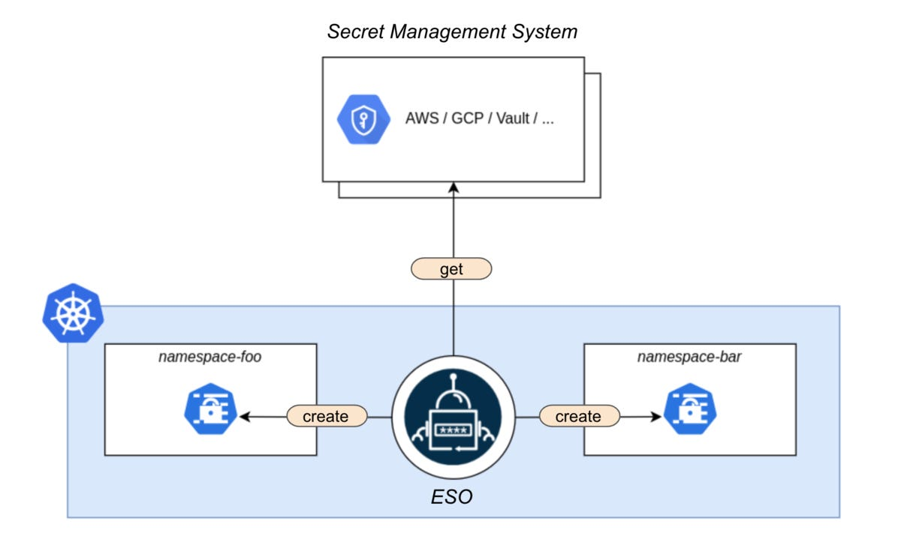

# Security - [External Secrets Operator][eso-doc]

## Késako ?

External Secrets Operator is a Kubernetes operator that integrates external secret management systems like AWS Secrets Manager, HashiCorp Vault, Google Secrets Manager, Azure Key Vault, IBM Cloud Secrets Manager, CyberArk Conjur and many more. The operator reads information from external APIs and automatically injects the values into a Kubernetes Secret.



## Install

```bash
## Install External Secret Operator
task security:eso-install
```

> ℹ️ Our tests will use the AWS Secret Manager, and to simulate it, we'll use LocalStack. See this [guide to installing LocalStack in a Kubernetes cluster](../../control-plane/aws/INSTALL.md)
>
> **Endpoint LocalStack (for [AWS Secret Manager][eso-aws-custom-endpoints]) is added during ESO installation**

## Test

```bash
## Create Secret Store
kubectl apply -f security/ESO/secretmanager.store.yml

## Storing a secret in AWS Secret Manager
aws secretsmanager create-secret \
    --name my-eso-secret \
    --description "My ESO Secret." \
    --secret-string "{\"password\":\"eso\"}"

## Link between an External Secret (on AWS Secret Manager) and a Secret in Kubernetes : ExternalSecret object
kubectl apply -f security/ESO/password.secret.yml

## Check that secrets (ExternalSecret and AWS Secret Manager) are synchronized
kubectl get es,secret
# NAME                                              STORE                REFRESH INTERVAL   STATUS         READY
# externalsecret.external-secrets.io/app-password   aws-secret-manager   1h                 SecretSynced   True
# NAME                                      TYPE                 DATA   AGE
# secret/app-password                       Opaque               1      2m27s

## Checking the contents of the Kubernes secret : "eso"
kubectl get secret/app-password -o jsonpath="{.data.app-password}" | base64 -d

## 🎉🎉 Simply reference Secret Kubernetes in our Workloads.
```

## Uninstall

```bash
kubectl delete -f security/ESO/secretmanager.store.yml
kubectl delete -f security/ESO/password.secret.yml

task security:eso-uninstall
```

## Resources

- [GESTION DES SECRETS SUR KUBERNETES][k8s-secret-management-blog]
- [Secrets store CSI driver vs external secrets in a nutshel][eso-vs-csi-secrets-store]
- [Clarity: secrets store CSI driver vs external secrets... what to use? #478][eso-vs-csi-secrets-store-clarity]

<!-- Links -->
[eso-doc]:https://external-secrets.io/latest/
[k8s-secret-management-blog]: https://toungafranck.com/2024/05/09/gestion-des-secret-sur-kubernetes/
[eso-aws-custom-endpoints]: https://external-secrets.io/latest/provider/aws-secrets-manager/#custom-endpoints
[eso-vs-csi-secrets-store]: https://www.yuribacciarini.com/secrets-store-csi-driver-vs-external-secrets-in-a-nutshel/
[eso-vs-csi-secrets-store-clarity]: https://github.com/external-secrets/external-secrets/issues/478
