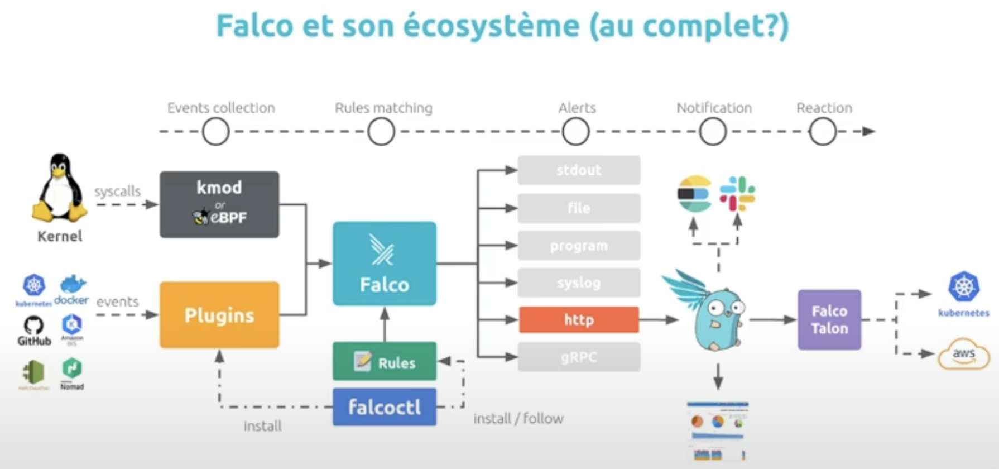
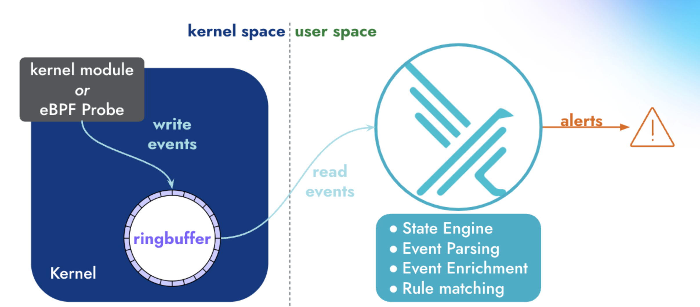
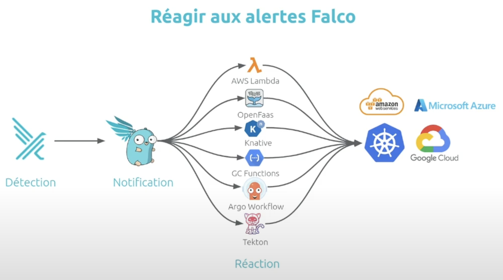
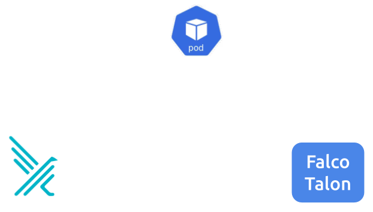

# Security - [Falco][falco-docs]

## Késako ?

Falco is a cloud-native security tool. It provides near real-time threat detection for cloud, container, and Kubernetes workloads by leveraging runtime insights. Falco can monitor events from various sources, including the Linux kernel, and enrich them with metadata from the Kubernetes API server, container runtime, and more.

Once Falco has received these events, it compares them to a set of [**rules**][falco-rules-doc] to determine if the actions being performed need further investigation. If they do, Falco can forward the **output** to multiple different [endpoints][falco-outputs-doc] either natively (*syslog, stdout, HTTP/S, and gRPC endpoints*) or with the help of [**Falcosidekick**][falcosidekick-doc], a companion tool that offers integrations to several different applications and services.



Falco operates in both *kernel and user space*. In kernel space, Linux system calls (**syscalls**) are collected by a **driver**, for example, the *Falco kernel module or Falco eBPF probe*. Next, syscalls are placed in a ring buffer from which they are moved into user space for processing. The events are filtered using a rules engine with a Falco rule set. Falco ships with a default set of rules, but operators can modify or turn off those rules and add their own. If Falco detects any suspicious events those are forwarded to various endpoints.



## Install

```bash
task security:falco-install
```

### Details of how to install rules and plugins

[**Plugins**][falco-plugins-doc] are a mechanism for extending Falco's event source (**syscalls**). There are [several plugins][falco-registed-plugins] developed by the community (*E.g : k8s-audit*)

Falco is also a rules engine, so the [**rules**][[falco-rules-doc]] are conditions under which an alert should be generated. A rule is accompanied by a descriptive output string that is sent with the alert. \
Falco's installation includes a set of predefined [rules][falco-default-rules].

[**Falcoctl**][falcoctl-docs] are component responsible to install and manage (*follow and update*) your rules and plugins (a.k.a *Artifacts*). All these artifacts are referenced in an [Index](https://falcosecurity.github.io/falcoctl/index.yaml).

In a Kubernetes context, 2 sidecars are associated with each instance of Falco :

- **falcoctl-artifact-install** : Installing artifacts (plugins and rules)
- **falcoctl-artifact-follow** : Follow and updating artifacts (*Default every 6 hours*)

The configuration of the artifacts to be managed by Falcoctl is defined in the [Helm values file](./helm.values.yml).

> ⚠️ You don't just need to install the artifacts, you also need to ask Falco to consider them: `falco.load_plugins` and `falco.rules_file`.

The [plugins][falco-registed-plugins] and rules are maintained by the Falco community and maintainer. And a plugin is generally associated with a set of rules

### Focus on [FalcoSideKick][falcosidekick-doc]

By default, Falco has 5 outputs for its events: *stdout*, *file*, *gRPC*, *shell* and *http*. Even if they're convenient, we can quickly be limited to integrating Falco with other components. Here comes Falcosidekick, a little daemon that extends that number of possible outputs.

FalcoSidekick integrates with Falco as an HTTP output. Falco alerts are redirected to FalcoSideKick.

The FalcoSideKick outputs are essentially notifications.  There are some (generally FaaS - Function As A Service) FalcoSideKick outputs that can be used to react on generated alerts. The idea is to develop a **Response Engine** and deploy it on a FaaS. \
The Response Engine can potentially change the state of the infrasctructure observed by Falco (*E.g. Terminate a Pod, Label a Pod, etc...*).

[A collection of articles from the Falco Blog showing the implementation of Response Engines][falcosidekick-response-engine-blog]



## Test

### Hello World Falco

```bash
## Start an Alpine container.
kubectl run alpine --image alpine -- sh -c "sleep infinity"

## Shell into the running container and run the uptime command. This will trigger Falco to send an Alert.
kubectl exec -it alpine -- sh -c "uptime"

## Examine Falco's output 
kubectl logs -l app.kubernetes.io/name=falco -n falco-system -c falco | grep Notice
# {"hostname":"kubernetes-stack-worker","output":"19:39:32.856027382: Notice A shell was spawned in a ... }
```

> The output to FalcoSidekick is also configured, so visit https://falcosidekick-ui.127.0.0.1.nip.io

Falco's output (*STDOUT and HTTP Falcosidekick*) is the result of rule [Terminal shell in container](https://github.com/falcosecurity/rules/blob/28b98b6f5f2fd1c1a82fc96c07bc844db33eb7cd/rules/falco_rules.yaml#L710)

## [Falco Talon][falco-talon-doc] - React to Falco alerts

We talked about Response Engine above, and this is code that is written and generally deployed on a FaaS to react to Falco alerts.

Writing code for your Response Engine has advantages in terms of **control and flexibility**. BUT it requires a lot of **cognitive load** for the developer (*managing actions, logs, authentication, the complexity of SDKs, etc...*).

In view of this cognitive load, the Falco Talon project is positioned as a **no-code** solution for creating a **fully customisable response engine** to work in pair with Falco, the runtime security component. \
It allows you to run series of actions following the name, the priority, the tags, the fields and more of the received Falco events. Falco Talon comes with multiple [**pre-integrated actions**][falco-talon-predifined-actionners] allowing you to focus on your rules and parameters and not on writing code.



### Hello World Falco Talon

> ℹ️ Previous FalcoSidekick integration configured to push alerts into Falco Talon
> ```yaml
> falcosidekick:
>  config: 
>    webhook:
>      address: http://falco-talon:2803
>```

In this example, we will use the [default rules][falco-talon-default-rules] provided by Falco Talon. In particular, we'll trigger the **"Terminal shell in container"** rule (*its action consists of labelling a Pod as suspicious*)

```bash
## Install Falco Talon Instance
task security:falco-talon-install

## Shell into the running container and run the uptime command. This will trigger Falco to send an Alert.
kubectl exec -it alpine -- sh -c "uptime"

## Observing Falco Talon's actions. Label -> suspicious: "true"
kubectl get po/alpine -o yaml
#apiVersion: v1
#kind: Pod
#metadata:
#  labels:
#    run: alpine
#    suspicious: "true"
```

## Uninstall

```bash
task security:falco-uninstall
task security:falco-talon-uninstall
```

## Resources

- [Faclco GitHub Chart Helm][falco-gh-chart-helm]
- [Réagir à temps aux menaces dans Kubernetes avec Falco (Rachid Zarouali, Thomas Labarussias)][falco-youtube]
- [Falco de A à Y][falco-blog-by-quentin-joly]

<!-- Links -->
[falco-docs]: https://falco.org/
[falco-youtube]: https://youtu.be/Mx28fhyKX7Q?si=GIQsPn2UOCsBl1JO
[falco-blog-by-quentin-joly]: https://une-tasse-de.cafe/blog/falco/
[falco-default-macros]: https://falco.org/docs/reference/rules/default-macros/
[falco-default-rules]: https://falco.org/docs/reference/rules/default-rules/
[falcoctl-docs]: https://falco.org/blog/falcoctl-install-manage-rules-plugins/
[falco-registed-plugins]: https://falco.org/docs/plugins/registered-plugins/
[falco-gh-chart-helm]: https://github.com/falcosecurity/charts/blob/master/charts/falco/README.md
[falco-rules-doc]: https://falco.org/docs/rules/
[falco-outputs-doc]: https://falco.org/docs/outputs/
[falcosidekick-doc]: https://falco.org/blog/extend-falco-outputs-with-falcosidekick/
[falco-plugins-doc]: https://falco.org/docs/plugins/
[falcosidekick-response-engine-blog]: https://falco.org/blog/falcosidekick-response-engine-part-1-kubeless/
[falco-talon-doc]: https://docs.falco-talon.org/
[falco-talon-predifined-actionners]: https://docs.falco-talon.org/docs/actionners/list/
[falco-talon-default-rules]: https://github.com/falco-talon/falco-talon/blob/main/deployment/helm/rules.yaml