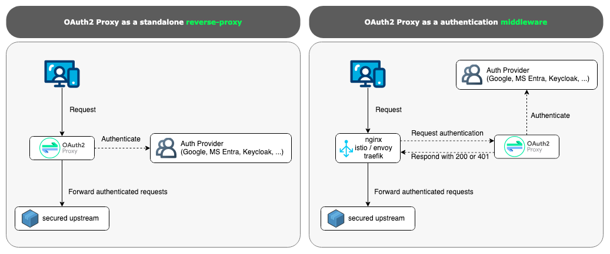

# [OAuth2 Proxy](https://oauth2-proxy.github.io/oauth2-proxy/)

## Késako ?

A reverse proxy and static file server that provides authentication using Providers (Google, GitHub, and others) to validate accounts by email, domain or group.

