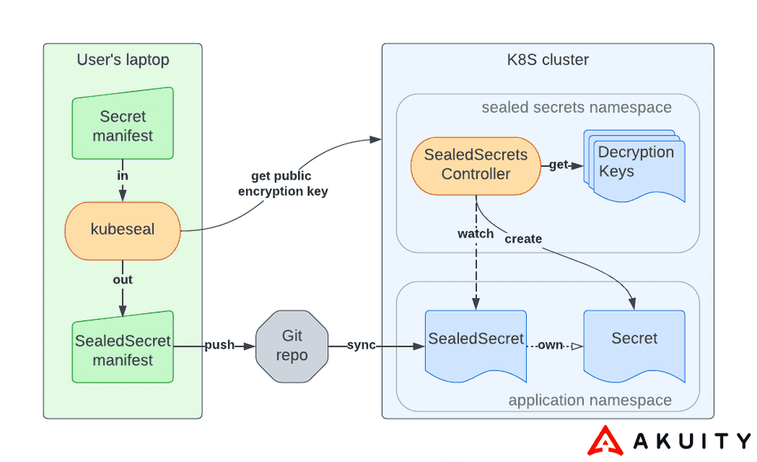

# Security - [Sealed Secret][sealed-secret-doc]

## Késako ?

You want to define a secret corresponding to an API token or something else. And in a GitOps approach, you store your Kubernetes manifests in a Git repository. **How can you ensure that the secret is not unencrypted in the Git repository ?**

Sealed secret is an open-source project developed by Bitnami. It enables Kubernetes secrets to be encrypted using a public/private key pair. The private key is present on the Kubernetes cluster, and the public key is used by developers to encrypt secrets.

Once a secret has been created and encrypted, only the Kubernetes cluster can decrypt it (or someone with the private key).



## Install

```bash
task security:sealed-secrets-install
```

## Test

```bash
## On the developer's laptop, we generate a SealedSecret Object
kubectl create secret generic my-secret --dry-run=client --from-literal=foo=bar -o yaml | kubeseal --controller-namespace kube-system --controller-name sealed-secrets --format yaml >| security/sealed-secret/my-secret.yaml

## The generated my-secret.yaml file can be versioned with Git

## Let's apply this object in Kubernetes
kubectl apply -f security/sealed-secret/my-secret.yaml

## Verify that a Kubernetes secret is generated by the Sealed Secret ontroller
kubectl get sealedsecrets,secret

# NAME                                 STATUS   SYNCED   AGE
# sealedsecret.bitnami.com/my-secret            True     3m20s
# NAME               TYPE     DATA   AGE
# secret/my-secret   Opaque   1      3m20s

## Check that the secret value ("bar")
kubectl get secret my-secret -o jsonpath="{.data.foo}" | base64 -d
```

> ℹ️ You can modify (e.g. add labels) the Sealed Secret object before sending it to a hosted Git.

To generate the Kubernetes secret, the Sealed Secret controller uses its private key. This secret can be referenced in a Workload.

To encrypt the secret, the `kubeseal --controller-namespace kube-system --controller-name sealed-secrets --format yaml` command retrieves the public key on the fly from the kubernetes cluster. \
If we don't have access to the cluster, we can extract and share the public key :

```bash
## Get public key - When accessing the cluster (kubeconfig)
kubeseal kubeseal --controller-namespace kube-system --controller-name sealed-secrets --fetch-cert > security/sealed-secret/cert.pem

## Get public key - Exposition via Ingress Resource
curl -L -o security/sealed-secret/cert.pem http://sealed-secrets.127.0.0.1.nip.io/v1/cert.pem

## Use this public key
kubectl create secret generic my-secret --dry-run=client --from-literal=foo=bar -o yaml | kubeseal --cert security/sealed-secret/cert.pem --format yaml >| security/sealed-secret/my-secret.yaml
```

If you want to reinstall your cluster, or have the same key in 2 different clusters, you can export the key used by Sealed-Secret in this way:

```bash
## Save your keys
kubectl get secret -n kube-system -l sealedsecrets.bitnami.com/sealed-secrets-key -o yaml > security/sealed-secret/sealed-secret-key.yaml

## Re-use the key
kubectl apply -n kube-system -f security/sealed-secret/sealed-secret-key.yaml
```

It is possible to retrieve sealed-secret metrics via the famous `/metrics` exposed by the `sealed-secrets-metrics` service. A Prometheus `ServiceMonitor` can be envisaged.

## Uninstall

```bash
kubectl delete -f security/sealed-secret/my-secret.yaml

task sealed-secrets-uninstall
```

## Resources

- [Sealed Secrets By Quentin JOLY][sealed-secrets-quentin-joly]
- [Sealed Secrets By Cockpitio][sealed-secrets-cockpitio]

<!-- Links -->
[sealed-secrets-quentin-joly]:https://une-tasse-de.cafe/blog/sealed-secrets/
[sealed-secrets-cockpitio]: https://blog.cockpitio.com/devops/sealed-secrets/
[sealed-secret-doc]: https://sealed-secrets.netlify.app/
