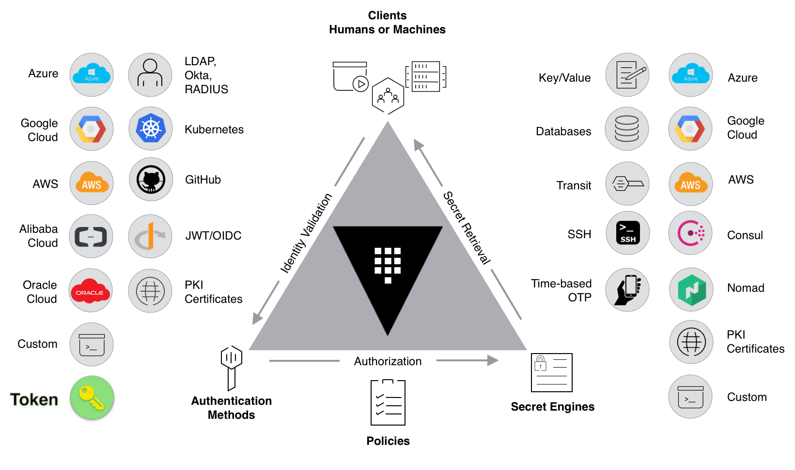

# [Vault][vault-doc]

## Késako ?

HashiCorp Vault is an identity-based secrets and encryption management system. A secret is anything that you want to tightly control access to, such as API encryption keys, passwords, and certificates. Vault provides encryption services that are gated by authentication and authorization methods. Using Vault’s UI, CLI, or HTTP API, access to secrets and other sensitive data can be securely stored and managed, tightly controlled (restricted), and auditable.



## Install

```bash
task security:vault-install
```

The Vault access endpoint is <http://vault.127.0.0.1.nip.io>

## Test

### Configure Secret Engine & Kubernetes authentication on Vault

#### Secret Engine

```bash
## 1. Enable kv-v2 secrets at the path of team "nzuguem".
vault secrets enable -path=nzuguem kv-v2

## 2.Create a secret at path "nzuguem/cloud/config/aws" with a access_key_id and "access_secret_key".
vault kv put nzuguem/cloud/config/aws access_key_id="foo" access_secret_key="bar"

## 3. Verify that the secret is defined at the path "nzuguem/cloud/config/aws"
vault kv get nzuguem/cloud/config/aws
```

#### Kubernetes authentication

Vault provides a Kubernetes authentication method that enables clients to authenticate with a Kubernetes Service Account Token. This token is provided to each pod when it is created.

```bash
## 1. Enable the Kubernetes authentication method.
vault auth enable kubernetes

## 2. Configure the Kubernetes authentication method to use the location of the Kubernetes API.
vault write auth/kubernetes/config \
      kubernetes_host="https://kubernetes.default.svc.cluster.local:443"

## 3. Write out the policy named "read-aws-config" that enables the read capability for secrets at path "nzuguem/cloud/config/aws"
vault policy write read-aws-config - <<EOF
path "nzuguem/data/cloud/config/aws" {
   capabilities = ["read"]
}
EOF

## 4. Create a Kubernetes authentication role named "aws-config-reader"
vault write auth/kubernetes/role/aws-config-reader \
      bound_service_account_names=aws-config-reader \
      bound_service_account_namespaces=default \
      policies=read-aws-config \
      ttl=24h
```

#### Define a Kubernetes service account

The name of the service account here aligns with the name assigned to the `bound_service_account_names` field when the `aws-config-reader` role was created.

```bash
## 1. Create a Kubernetes service account named "aws-config-reader" in the default namespace
kubectl create sa aws-config-reader

## 2. Verify that the service account has been created.
kubectl get sa -n default
```

### Inject secrets: Using [Vault Agent][vault-agent-doc]

Vault Agent aims to remove the initial hurdle to adopt Vault by providing a more scalable and simpler way for applications to integrate with Vault, by providing the ability to render templates containing the secrets required by your application, without requiring changes to your application.


Injection uses the [annotation][vault-agent-annotations-list] mechanism

```bash
## 1. Deploy Workload
kubectl apply -f security/vault/busybox.deploy.yml -n default

## 2. Check that the Pods contain 2 containers (Running 2/2)
kubectl get po -n default

## 3. Display the secret written to the spring-native container
stern deploy/busybox -c busybox | grep "AWS_"
```

### Inject secrets: Using [External Secret Operator](../ESO/README.md)

```bash
## 1. Create ClusterSecretStore
kubectl apply -f security/vault/vault.store.yml

## 2. Create External Secret
kubectl apply -f security/vault/aws-config.secret.yml

## 3. Display Secret created By ESO
kubectl get secret/aws-config-secret -o jsonpath="{.data.AWS_ACCESS_KEY_ID}" | base64 -d

kubectl get secret/aws-config-secret -o jsonpath="{.data.AWS_ACCESS_SECRET_KEY}" | base64 -d
```

## Alternatives

- [OpenBAO](https://openbao.org/) : An open source, community-driven fork of Vault managed by the Linux Foundation.

## Uninstall

```bash
task security:vault-uninstall
```

<!-- Links -->
[vault-agent-doc]: https://developer.hashicorp.com/vault/docs/agent-and-proxy/agent
[vault-agent-annotations-list]:https://developer.hashicorp.com/vault/docs/platform/k8s/injector/annotations
[vault-doc]: <https://developer.hashicorp.com/vault>
