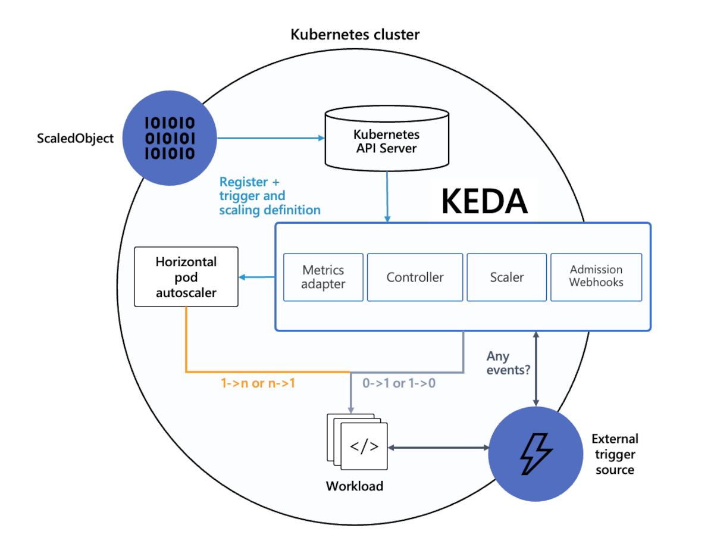
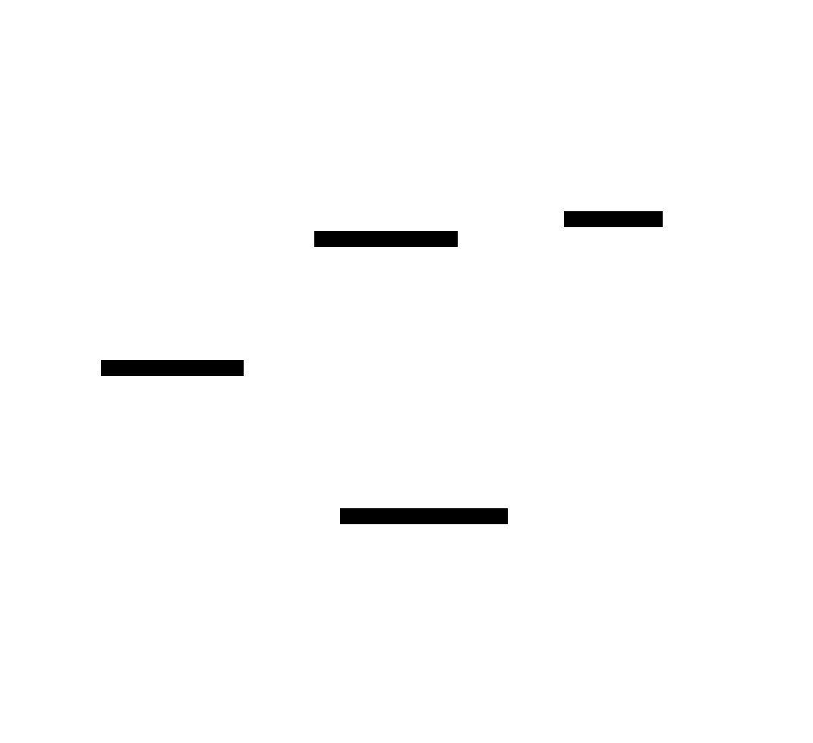

# [KEDA - Kubernetes Event-driven Autoscaling][keda-doc]

## Késako ?

KEDA is a Kubernetes-based Event Driven Autoscaler. With KEDA, you can drive the scaling of any container in Kubernetes based on the number of events needing to be processed. Unlike traditional auto-scaling, which relies only on CPU or memory usage, KEDA responds to external events such as the number of messages in a queue, incoming HTTP requests, or database metrics. It works by combining a ScalableObject with a Scaler that monitors a data source (e.g., Apache Kafka, AWS SQS, or PostgreSQL) to trigger pod scaling up or down, optimizing resource utilization.

**KEDA is an extension of HPA (Horizontal Pod Autoscaling) to enable Scale To/From Zero. HPA applies once Kubernetes has created at least one pod. So KEDA performs Scale From/To 1 via HPA and Scale From/To 0 via its internal controller.**

> ℹ️ If you're just doing Scale From/To 1, an alternative to KEDA would be **Prometheus Metric Adapter** (*although its configuration is counter-intuitive*). This implements the [External][k8s-external-metrics] / [Custom][k8s-custom-metrics] Metrics API of Kubernetes



- **Trigger/Event Sources** : An external system like Kafka, RabbitMQ, that generates events that KEDA can monitor using a scaler.
- **Scalers** : Component that monitors event sources and extracts metrics. **The scaler is strongly linked to the event source** source
- **Metric Adapter** : Component that takes metrics from scalers and translates or adapts them into a form that HPA/controller component can understand.
- **Admission Webhook**: In Kubernetes, an HTTP callback that handle admission requests. KEDA uses an admission webhook to validate and mutate ScaledObject resources.
- **Scaled Object**: A custom resource that defines how KEDA should scale a workload based on events.
- **Controller** : Component for making scale decisions From/To 0

## Install

```bash
task serverless:keda-install
```

## Test

The test will use RabbitMQ as the event source

```bash
## RabbitMQ Producer
### The producer is a Job that will produce 100 messages in RabbitMQ
k apply -f serverless/keda/rabbitmq.secret.yml -f serverless/keda/rabbitmq.sender.yml

## RabbitMQ Receiver & ScaleObject
### The ScaleObject is configured to have 1 Pod for a QueueSize = 5.
k apply -f serverless/keda/rabbitmq.receiver.yml

## see KEDA in Action
k get deploy/rabbitmq-receiver
# NAME                READY   UP-TO-DATE   AVAILABLE   AGE
# rabbitmq-receiver   20/20   20           20          13m
```

## KEDA HTTP addon

Autoscaling HTTP is often not as straightforward as other event sources. You don’t know how much traffic will be coming and, given its synchronous nature, supporting scale-to-zero HTTP applications requires an intelligent intermediate routing layer to “hold” the incoming request(s) until new instances of the backend application are created and running.



### Test

```bash
## Deploy Hello App and HTTPScaleObject
k apply -f serverless/keda/hello.deploy.yml -f serverless/keda/hello.httpscale.yml

# Pods Watch
watch kubectl get po

# Execute this command in a different terminal and return to the watch terminal to observe the scaling action
for i in {1..1000}; do curl http://hello-keda-http.127.0.0.1.nip.io/hello/Keda & done; wait
```

## Uninstall

```bash
task serverless:keda-uninstall
```

## Resources

- [Source Code of RabbitMQ Sender/Receiver][keda-rabbitmq]
- [Google Cloud - Scaling à zéro instance à l'aide de KEDA][scale-to-zero-using-keda]
- [Optimisation des ressources Kubernetes avec l’autoscaling horizontal des pods via des custom metrics et le Prometheus Adapter][optimisation-ressources-kubernetes-autoscaling-horizontal-custom-metrics-prometheus-adapter]
- [À propos des métriques personnalisées, Prometheus et externes][about_custom_prometheus_and_external_metrics]
- [Trying KEDA HTTP addon][trying-keda-http-addon]

<!-- Links -->
[keda-doc]: https://keda.sh/
[keda-rabbitmq]: https://github.com/axinorm/keda-rabbitmq
[scale-to-zero-using-keda]: <https://cloud.google.com/kubernetes-engine/docs/tutorials/scale-to-zero-using-keda?hl=fr#helm>
[k8s-external-metrics]: https://kubernetes.io/docs/reference/external-api/external-metrics.v1beta1/
[k8s-custom-metrics]: https://kubernetes.io/docs/reference/external-api/custom-metrics.v1beta2/
[about_custom_prometheus_and_external_metrics]: https://cloud.google.com/kubernetes-engine/docs/concepts/custom-and-external-metrics?hl=fr#about_custom_prometheus_and_external_metrics
[optimisation-ressources-kubernetes-autoscaling-horizontal-custom-metrics-prometheus-adapter]: <https://blog.zwindler.fr/2024/10/11/optimisation-ressources-kubernetes-autoscaling-horizontal-custom-metrics-prometheus-adapter/>
[trying-keda-http-addon]: https://flagzeta.org/articles/trying-keda-http-addon
