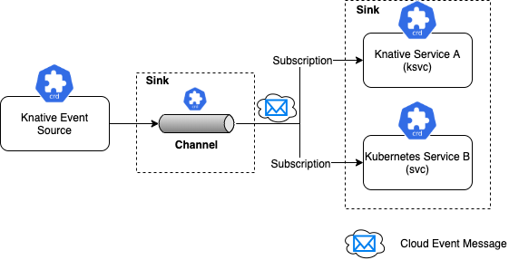

# [Knative Eventing][knative-eventing-doc]

## Késako ?

Knative Eventing is a collection of APIs that enable you to use an event-driven architecture with your applications. You can use these APIs to create components that route events from event producers (known as sources) to event consumers (known as sinks) that receive events. ***Sinks can also be configured to respond to HTTP requests by sending a response event.***
Knative Eventing uses ***standard HTTP POST requests to send and receive events between event producers and sinks***. These events conform to the [CloudEvents specifications][cloudevents-specifications], which enables creating, parsing, sending, and receiving events in any programming language.

## Install

```bash
task serverless:knative-eventing-install
```

## Scenarios

> ℹ️ Make sure you install Knative Service

Only when an event occurs is the Service Knative scaled from Zero. So if there are no events, then Scale To Zero. You can use this command to observe scaling (Up/Down):

```bash
## 
kubectl get po -l serving.knative.dev/configuration=eventing-hello -w
```

### 1. Simple Delivery

#### Késako ?

Source to Service provides the simplest getting started experience with Knative Eventing. It provides single Sink — that is, event receiving service --, with no queuing, backpressure, and filtering. The Source to Service does not support replies, which means the response from the Sink service is ignored.


#### Test

```bash
## Deploy Knative Service Consumer (Wait Service is Ready : kubectl get ksvc)
kubectl apply -f serverless/knative/eventing/consumer.service.yml

## Deploy Knative Eventing Source : Ping (Wait Source is Ready : kubectl get pingsources)
kubectl apply -f serverless/knative/eventing/ping-ksvc.source.yml

## Check the logs and see the message sent (spec. CloudEvents) by PingSource
kubectl logs po/<POD_NAME> -c user-container

# 2024-05-11 08:34:13,656 INFO  [eventing-hello] (executor-thread-1) ce-id=ffd53eae-8ca9-4ae9-bb19-857aa889f66d
# 2024-05-11 08:34:13,657 INFO  [eventing-hello] (executor-thread-1) ce-source=/apis/v1/namespaces/default/pingsources/# eventing-hello-ping-source
# 2024-05-11 08:34:13,658 INFO  [eventing-hello] (executor-thread-1) ce-specversion=1.0
# 2024-05-11 08:34:13,660 INFO  [eventing-hello] (executor-thread-1) ce-time=2024-05-11T08:34:00.285888925Z
# 2024-05-11 08:34:13,661 INFO  [eventing-hello] (executor-thread-1) ce-type=dev.knative.sources.ping
# 2024-05-11 08:34:13,662 INFO  [eventing-hello] (executor-thread-1) content-type=null
# 2024-05-11 08:34:13,663 INFO  [eventing-hello] (executor-thread-1) content-length=48
# 2024-05-11 08:34:13,664 INFO  [eventing-hello] (executor-thread-1) POST:{"message": "Thanks for doing Knative Tutorial"}
```

### 2. Channel and Subscribers

#### Késako ?

With the Channel and Subscription, the Knative Eventing system defines a Channel, which can connect to various backends such as In-Memory, Kafka and GCP PubSub for sourcing the events. Each Channel can have one or more subscribers in the form of Sink services, which can receive the event messages and process them as needed. Each message from the Channel is formatted as CloudEvent and sent further up in the chain to other Subscribers for further processing. The Channels and Subscription usage pattern does not have the ability to filter messages.



#### Test

```bash
## Deploy Channel
kubectl apply -f serverless/knative/eventing/hello.channel.yml

## Deploy Knative Eventing Source : Ping (Wait Source is Ready : kubectl get pingsources)
kubectl apply -f serverless/knative/eventing/ping-channel.source.yml

## Deploy Knative Service Consumer (Wait Service is Ready : kubectl get ksvc)
kubectl apply -f serverless/knative/eventing/consumer-subs.service.yml

## Deploy Subscription on Channel
kubectl apply -f serverless/knative/eventing/hello.subscription.yml

## Check the logs and see the message sent (spec. CloudEvents) by PingSource
kubectl logs po/<POD_NAME> -c user-container
```

## Uninstall

```bash
kubectl delete -f serverless/knative/eventing/ping-ksvc.source.yml
kubectl delete -f serverless/knative/eventing/consumer.service.yml

kubectl delete -f serverless/knative/eventing/hello.subscription.yml
kubectl delete -f serverless/knative/eventing/consumer-subs.service.yml
kubectl delete -f serverless/knative/eventing/ping-channel.source.yml
kubectl delete -f serverless/knative/eventing/hello.channel.yml

task serverless:knative-eventing-uninstall
```

<!-- Links -->
[knative-eventing-doc]: https://knative.dev/docs/eventing/
[cloudevents-specifications]: https://cloudevents.io/