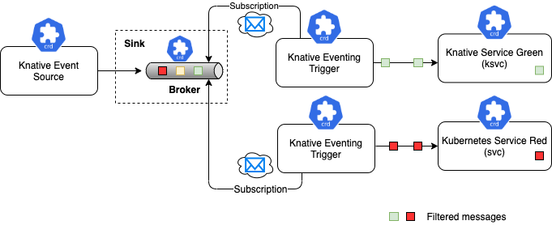

# [Knative Eventing][knative-eventing-doc]

## Késako ?

Knative Eventing is a collection of APIs that enable you to use an event-driven architecture with your applications. You can use these APIs to create components that route events from event producers (known as sources) to event consumers (known as sinks) that receive events. ***Sinks can also be configured to respond to HTTP requests by sending a response event.***
Knative Eventing uses ***standard HTTP POST requests to send and receive events between event producers and sinks***. These events conform to the [CloudEvents specifications][cloudevents-specifications], which enables creating, parsing, sending, and receiving events in any programming language.

## Install

```bash
task serverless:knative-eventing-install
```

## Scenarios

Only when an event occurs is the Service Knative scaled from Zero. So if there are no events, then Scale To Zero. You can use this command to observe scaling (Up/Down):

```bash
##
kubectl get po -l serving.knative.dev/configuration=eventing-hello -w
```

### 1. Simple Delivery (Source To Service)

#### Késako ?

**Source to Service** provides the simplest getting started experience with Knative Eventing. It provides single Sink — that is, event receiving service --, with no queuing, backpressure, and filtering. The **Source to Service** does not support replies, which means the response from the Sink service is ignored.


#### Test

```bash
## Deploy Knative Service Consumer (Wait Service is Ready : kubectl get ksvc)
kubectl apply -f serverless/knative/eventing/source-to-service/consumer.service.yml

## Deploy Knative Eventing Source : Ping (Wait Source is Ready : kubectl get pingsources)
kubectl apply -f serverless/knative/eventing/source-to-service/ping-ksvc.source.yml

## Check the logs and see the message sent (spec. CloudEvents) by PingSource
stern eventing-hello -c user-container

# 2024-05-11 08:34:13,656 INFO  [eventing-hello] (executor-thread-1) ce-id=ffd53eae-8ca9-4ae9-bb19-857aa889f66d
# 2024-05-11 08:34:13,657 INFO  [eventing-hello] (executor-thread-1) ce-source=/apis/v1/namespaces/default/pingsources/# eventing-hello-ping-source
# 2024-05-11 08:34:13,658 INFO  [eventing-hello] (executor-thread-1) ce-specversion=1.0
# 2024-05-11 08:34:13,660 INFO  [eventing-hello] (executor-thread-1) ce-time=2024-05-11T08:34:00.285888925Z
# 2024-05-11 08:34:13,661 INFO  [eventing-hello] (executor-thread-1) ce-type=dev.knative.sources.ping
# 2024-05-11 08:34:13,662 INFO  [eventing-hello] (executor-thread-1) content-type=null
# 2024-05-11 08:34:13,663 INFO  [eventing-hello] (executor-thread-1) content-length=48
# 2024-05-11 08:34:13,664 INFO  [eventing-hello] (executor-thread-1) POST:{"message": "Thanks for doing Knative Tutorial"}
```

### 2. Channel and Subscribers

#### Késako ?

With the Channel and Subscription, the Knative Eventing system defines a Channel, which can connect to various backends such as In-Memory, Kafka and GCP PubSub for sourcing the events. Each Channel can have one or more subscribers in the form of Sink services, which can receive the event messages and process them as needed. Each message from the Channel is formatted as CloudEvent and sent further up in the chain to other Subscribers for further processing. The Channels and Subscription usage pattern does not have the ability to filter messages.


#### Test

```bash
## Deploy Channel
kubectl apply -f serverless/knative/eventing/channels-subscribers/hello.channel.yml

## Deploy Knative Eventing Source : Ping (Wait Source is Ready : kubectl get pingsources)
kubectl apply -f serverless/knative/eventing/channels-subscribers/ping-channel.source.yml

## Deploy Knative Service Consumer (Wait Service is Ready : kubectl get ksvc)
kubectl apply -f serverless/knative/eventing/channels-subscribers/consumer-subs.service.yml

## Deploy Subscription on Channel
kubectl apply -f serverless/knative/eventing/channels-subscribers/hello.subscription.yml

## Check the logs and see the message sent (spec. CloudEvents) by PingSource
stern eventing-hello-subs -c user-container

# 2024-05-13 16:18:02,063 INFO  [me.nzu.clo.Handler] (quarkus-virtual-thread-0) CloudEvents : Binary Content mode
# 2024-05-13 16:18:02,064 INFO  [me.nzu.clo.Handler] (quarkus-virtual-thread-0) ce-id=b4736812-5976-492a-ad02-fbae65ac9ab7
# 2024-05-13 16:18:02,064 INFO  [me.nzu.clo.Handler] (quarkus-virtual-thread-0) ce-source=/apis/v1/namespaces/default/pingsources/event-greeter-ping-source
# 2024-05-13 16:18:02,064 INFO  [me.nzu.clo.Handler] (quarkus-virtual-thread-0) ce-specversion=1.0
# 2024-05-13 16:18:02,064 INFO  [me.nzu.clo.Handler] (quarkus-virtual-thread-0) ce-type=dev.knative.sources.ping
# 2024-05-13 16:18:02,064 INFO  [me.nzu.clo.Handler] (quarkus-virtual-thread-0) Content-Type=null
# 2024-05-13 16:18:02,064 INFO  [me.nzu.clo.Handler] (quarkus-virtual-thread-0) Revcieve Event : CloudEvent{ ...
```

This scenario (*Channel and Subscribers*) supports ***Reply***. The Consumer (Service) must respond to the HTTP POST request, with the **CloudEvents body (Binary Content Mode)**. This response can be transmitted to another **Channel**: ***this is Event Pipe***

```bash
## Deploy Channel (in which the "eventing-hello" subscription will push the Reply of its consumer)
kubectl apply -f serverless/knative/eventing/channels-subscribers/hello-reply.channel.yml

## Deploy Knative Service Consumer (Wait Service is Ready : kubectl get ksvc)
kubectl apply -f serverless/knative/eventing/channels-subscribers/consumer-subs-reply.service.yml

## Deploy Subscription on Channel Reply
kubectl apply -f serverless/knative/eventing/channels-subscribers/hello-reply.subscription.yml

## Check the logs and see the message sent (spec. CloudEvents) by PingSource
## Observe the CloudEvents headers, you will see values with the "reply"
stern eventing-hello-subs-reply -c user-container

# 2024-05-13 16:18:02,238 INFO  [me.nzu.clo.Handler] (quarkus-virtual-thread-0) CloudEvents : Binary Content mode
# 2024-05-13 16:18:02,238 INFO  [me.nzu.clo.Handler] (quarkus-virtual-thread-0) ce-id=4a25f802-2c92-437d-b439-9ed13ece12eb
# 2024-05-13 16:18:02,239 INFO  [me.nzu.clo.Handler] (quarkus-virtual-thread-0) ce-source=/events/example/reply
# 2024-05-13 16:18:02,239 INFO  [me.nzu.clo.Handler] (quarkus-virtual-thread-0) ce-specversion=1.0
# 2024-05-13 16:18:02,239 INFO  [me.nzu.clo.Handler] (quarkus-virtual-thread-0) ce-type=me.nzuguem.cloudevents.example.reply
# 2024-05-13 16:18:02,239 INFO  [me.nzu.clo.Handler] (quarkus-virtual-thread-0) Content-Type=application/json
# 2024-05-13 16:18:02,239 INFO  [me.nzu.clo.Handler] (quarkus-virtual-thread-0) Revcieve Event : CloudEvent{ ...
```

### 3. Broker and Trigger

#### Késako ?

The Broker and Trigger are similar to Channel and Subscription, except that they support filtering of events. Event filtering is a method that allows the subscribers to show an interest on certain set of messages that flows into the Broker. ***For each Broker, Knative Eventing will implicitly create a Knative Eventing Channel.***

This is an implementation of the **[EIP Content-Based Router pattern][eip-content-based-router]**.



#### Test

> ℹ️ A default Brocker is created when the Knative Eventing operator is installed.

```bash
## Deploy Knative Eventing Source : Ping (Wait Source is Ready : kubectl get pingsources)
kubectl apply -f serverless/knative/eventing/brokers-triggers/ping-broker.source.yml

## Deploy Knative Service Consumer (Wait Service is Ready : kubectl get ksvc)
kubectl apply -f serverless/knative/eventing/brokers-triggers/consumer-trigger.service.yml

## Deploy Trigger object
kubectl apply -f serverless/knative/eventing/brokers-triggers/hello.trigger.yml

## Check the logs and see the message sent (spec. CloudEvents) by PingSource
stern eventing-hello-trigger-service -c user-container

# 2024-05-16 11:14:00,500 INFO  [me.nzu.clo.Handler] (quarkus-virtual-thread-0) Revcieve Event ID : 35e7a8f5-af86-473b-bbac-2ff685fec638
# 2024-05-16 11:14:00,503 INFO  [me.nzu.clo.Handler] (quarkus-virtual-thread-0) CloudEvents : Binary Content mode
# 2024-05-16 11:14:00,503 INFO  [me.nzu.clo.Handler] (quarkus-virtual-thread-0) ce-id=35e7a8f5-af86-473b-bbac-2ff685fec638
# 2024-05-16 11:14:00,504 INFO  [me.nzu.clo.Handler] (quarkus-virtual-thread-0) ce-source=/apis/v1/namespaces/default/pingsources/eventing-hello-ping-source-broker
# 2024-05-16 11:14:00,504 INFO  [me.nzu.clo.Handler] (quarkus-virtual-thread-0) ce-specversion=1.0
# 2024-05-16 11:14:00,504 INFO  [me.nzu.clo.Handler] (quarkus-virtual-thread-0) ce-type=dev.knative.sources.ping
# 2024-05-16 11:14:00,504 INFO  [me.nzu.clo.Handler] (quarkus-virtual-thread-0) Content-Type=null
# 2024-05-16 11:14:00,504 INFO  [me.nzu.clo.Handler] (quarkus-virtual-thread-0) Revcieve Event : CloudEvent{
```

The consumer replies in the broker in the form of CloudEvents. So we can have another consumer who only consumes these events

```bash
## Deploy Trigger object
kubectl apply -f serverless/knative/eventing/brokers-triggers/hello-reply.trigger.yml

## Deploy Knative Service Consumer (Wait Service is Ready : kubectl get ksvc)
kubectl apply -f serverless/knative/eventing/brokers-triggers/consumer-trigger-reply.service.yml

## Check the logs and see the message sent (spec. CloudEvents) by PingSource
stern eventing-hello-trigger-service-reply -c user-container

# 2024-05-16 11:24:34,155 INFO  [me.nzu.clo.Handler] (quarkus-virtual-thread-261) Revcieve Event ID : d075ed48-20e6-4806-828a-139195195aa4
# 2024-05-16 11:24:34,157 INFO  [me.nzu.clo.Handler] (quarkus-virtual-thread-261) CloudEvents : Binary Content mode
# 2024-05-16 11:24:34,157 INFO  [me.nzu.clo.Handler] (quarkus-virtual-thread-261) ce-id=d075ed48-20e6-4806-828a-139195195aa4
# 2024-05-16 11:24:34,157 INFO  [me.nzu.clo.Handler] (quarkus-virtual-thread-261) ce-source=/events/example/reply
# 2024-05-16 11:24:34,157 INFO  [me.nzu.clo.Handler] (quarkus-virtual-thread-261) ce-specversion=1.0
# 2024-05-16 11:24:34,157 INFO  [me.nzu.clo.Handler] (quarkus-virtual-thread-261) ce-type=me.nzuguem.cloudevents.example.reply
# 2024-05-16 11:24:34,157 INFO  [me.nzu.clo.Handler] (quarkus-virtual-thread-261) Content-Type=application/json
# 2024-05-16 11:24:34,157 INFO  [me.nzu.clo.Handler] (quarkus-virtual-thread-261) Revcieve Event : CloudEvent{
```

### 4. [SinkBinding][sinkbinding-doc]

#### Késako ?

Sink binding can be used to ***create new event sources using any of the familiar compute objects that Kubernetes makes available***. For example, *Deployment, Job, DaemonSet, or StatefulSet objects, or Knative abstractions, such as Service or Configuration objects, can be used*.

Sink binding injects environment variables (`K_SINK`) into the **PodTemplateSpec** of the event sink, so that the application code does not need to interact directly with the Kubernetes API to locate the event destination.

#### Test

```bash
## Deploy two Service (Consumer, Producer)
kubectl apply -f serverless/knative/eventing/sink-binding/producer-sb.deploy.yml
kubectl apply -f serverless/knative/eventing/sink-binding/consumer-sb.service.yml

## Deploy SinkBinding, to link two Services
kubectl apply -f serverless/knative/eventing/sink-binding/sinkbinding.yml

## Send the request to producer
curl -v http://producer-sb.127.0.0.1.nip.io \
    -H "Content-Type: application/cloudevents+json" \
    -d @serverless/knative/eventing/sink-binding/cloud-events-structured.example.json

## Check the logs and see the message sent (spec. CloudEvents) by PingSource
## Check the original message in the logs : "This is an example of structured Content Mode"
stern eventing-hello-service-sb -c user-container

# 2024-05-16 12:17:49,224 INFO  [me.nzu.clo.Handler] (quarkus-virtual-thread-0) Revcieve Event ID : 1e997d37-6f62-47a2-93a1-3cfa8a6cb571
# 2024-05-16 12:17:49,233 INFO  [me.nzu.clo.Handler] (quarkus-virtual-thread-0) CloudEvents : Structured Content mode
# 2024-05-16 12:17:49,234 INFO  [me.nzu.clo.Handler] (quarkus-virtual-thread-0) Revcieve Event : CloudEvent{id='1e997d37-6f62-47a2-93a1-3cfa8a6cb571', source=/events/example/reply, type='me.nzuguem.cloudevents.example.reply', datacontenttype='application/json', subject='reply', data=JsonCloudEventData{node={"message":"This is an example of structured Content Mode"}}, extensions={}}
```

## Uninstall

```bash
task serverless:knative-eventing-uninstall
```

<!-- Links -->
[knative-eventing-doc]: https://knative.dev/docs/eventing/
[cloudevents-specifications]: https://cloudevents.io/
[eip-content-based-router]: https://www.enterpriseintegrationpatterns.com/patterns/messaging/ContentBasedRouter.html
[sinkbinding-doc]: https://knative.dev/docs/eventing/custom-event-source/sinkbinding/
