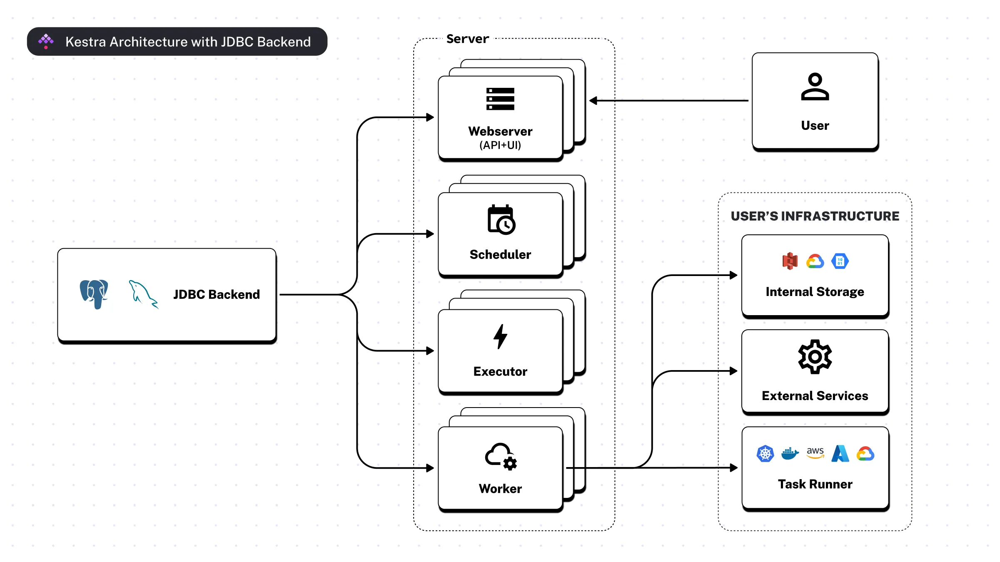
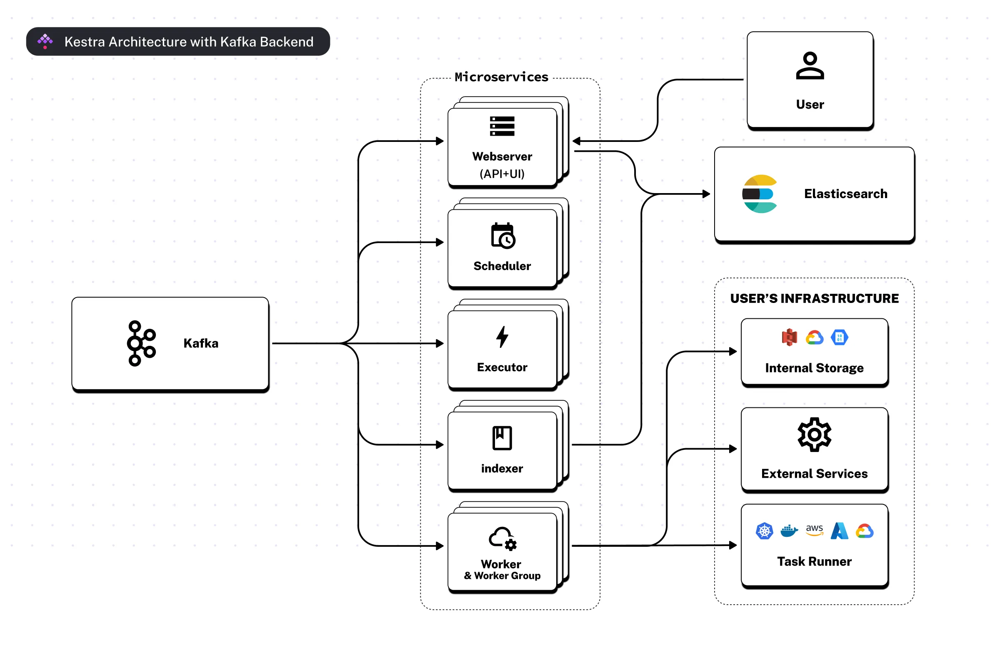
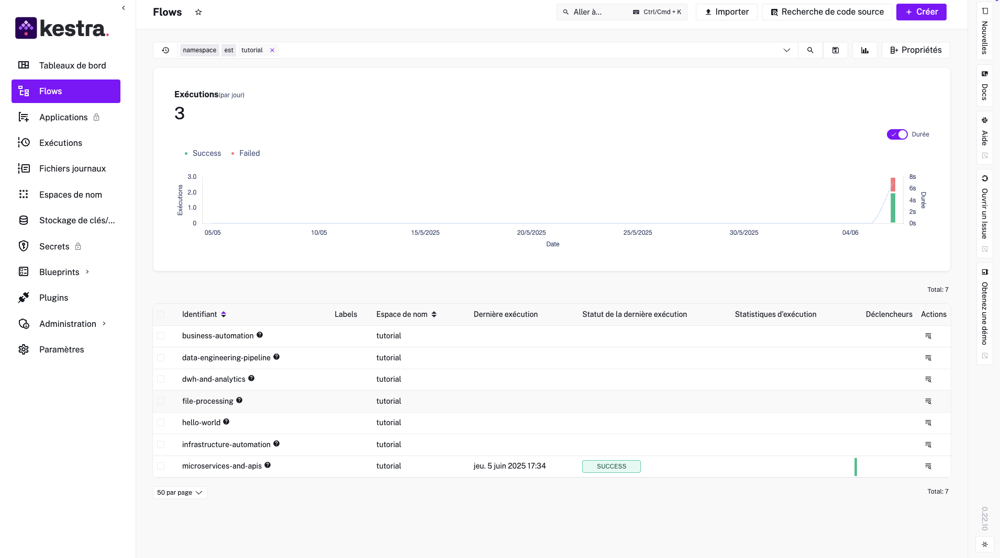

# [Kestra](https://github.com/kestra-io/kestra)

## Késako ?

Kestra is an open-source, event-driven orchestration platform that makes both scheduled and event-driven workflows easy. By bringing Infrastructure as Code best practices to data, process, and microservice orchestration, you can build reliable workflows directly from the UI in just a few lines of YAML.

### [Architecture with JDBC backend](https://kestra.io/docs/architecture#architecture-with-jdbc-backend)



### [Architecture with Kafka and Elasticsearch backend](https://kestra.io/docs/architecture#architecture-with-kafka-and-elasticsearch-backend)



## Install

> ℹ️ By default, the chart will deploy one [standalone Kestra service / Small-sized deployment](https://kestra.io/docs/architecture/deployment-architecture#small-sized-deployment) with one replica i.e. all Kestra server components will be deployed in a single pod.
>
> Others [Deployment Architecture](https://kestra.io/docs/architecture/deployment-architecture)

```bash
task workflows:kestra-install
```

> ⚠️ It takes a little time, so you have to be patient.

Visit <http://kestra.127.0.0.1.nip.io>

## Test

To test, you can run the Flows already present in the Namespace `tutorial` or simply create your own.



> ⚠️ **For a better workflow for developing and deploying flows in production, you can opt for the [GitOps approach](https://kestra.io/blogs/2024-06-05-gitops-superpowers)**

## Uninstall

```bash
task workflows:kestra-uninstall
```

## Resources

- [🎥 Kestra: OpenSource Event Driven Declarative Orchestrator — Loïc MATHIEU et Ludovic DEHON](https://youtu.be/vUtlLUdKNPA?si=H63T-346_1174i52)
- [Install Kestra in a Kubernetes cluster using a Helm chart.](https://kestra.io/docs/installation/kubernetes)
