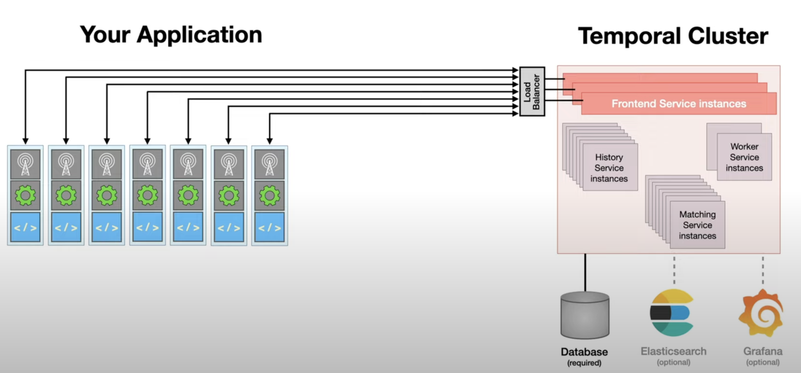

# [Temporal IO][temporal.io]

## Késako ?

Temporal is a distributed, scalable, durable, and highly available orchestration engine designed to execute asynchronous long-running business logic in a resilient way.



## Install

```bash
task workflows:temporal-install
```

> ⚠️ Installation can take several minutes

Visit UI :  <http://temporal-ui.127.0.0.1.nip.io>

## Connect To Temporal **Frontend Service**

### Via Temporal CLI

> ℹ️ After installing the Helm Temporal chart, I automatically configure the CLI to consider the Frontend Service address and the Ingress certificate:
>
> ```bash
> kubectl get secret temporal-gateway.127.0.0.1.nip.io-tls -n temporal-system -o jsonpath="{['data']['ca\.crt']}" | base64 --decode > /home/vscode/temporal-ing-ca.crt
> cat <<EOF >> /home/vscode/.bashrc
> export TEMPORAL_TLS_CA=/home/vscode/temporal-ing-ca.crt
> export TEMPORAL_ADDRESS=temporal-gateway.127.0.0.1.nip.io:443
> EOF
> source /home/vscode/.bashrc
>```

```bash
## Get Health of Temporal Cluster
temporal operator cluster health
# SERVING

## Create namespace Team 1
temporal operator namespace create --retention 5d --namespace team-temporal
# Namespace team-temporal successfully registered.

## Create namespace Team 2
temporal operator namespace create --retention 5d --namespace team-cadence
# Namespace team-cadence successfully registered.
```

#### Temporal accessible via the K8S Gateway API

```bash
temporal operator namespace create --retention 5d --namespace t
eam-gateway-api --address temporal-gateway-new.127.0.0.1.nip.io:9080
# Namespace team-cadence successfully registered.
```

### Via Temporal SDK Java

```java
import io.grpc.Grpc;
import io.grpc.ManagedChannel;
import io.grpc.TlsChannelCredentials;
import io.grpc.netty.shaded.io.netty.handler.ssl.util.InsecureTrustManagerFactory;
import io.temporal.serviceclient.WorkflowServiceStubs;
import io.temporal.serviceclient.WorkflowServiceStubsOptions;

// https://github.com/grpc/grpc-java/issues/10523
ManagedChannel managedChannel = Grpc.newChannelBuilder("temporal-gateway.127.0.0.1.nip.io:443",
        TlsChannelCredentials.newBuilder()
                .trustManager(InsecureTrustManagerFactory.INSTANCE.getTrustManagers()[0])
                .build()
        ).build();
WorkflowServiceStubs service = WorkflowServiceStubs.newServiceStubs(
        WorkflowServiceStubsOptions.newBuilder()
                .setChannel(managedChannel)
                .build()
        );
```

> ℹ️ You can see that I'm using an `InsecureTrustManagerFactory`. The simple reason that the ingress certificate is self-signed, and to avoid getting the [*Empty issuer DN not allowed in X509Certificates* error][cert-manager-certificate-validity], I decide to bypass the SSL verification.
>
> ⚠️ **However, this configuration is exclusively reserved for Tests. For production use, you should consider using [Security Features][temporal-self-hosted-security]**

#### Temporal accessible via the K8S Gateway API

```java
import io.temporal.serviceclient.WorkflowServiceStubs;
import io.temporal.serviceclient.WorkflowServiceStubsOptions;

WorkflowServiceStubs service = WorkflowServiceStubs.newServiceStubs(
        WorkflowServiceStubsOptions.newBuilder()
                .setTarget("temporal-gateway-new.127.0.0.1.nip.io:9080")
                .build()
        );
```

## Uninstall

```bash
task discovery:temporal-uninstall
```

## Resources

- [Temporal Helm Chart][temporal-helm-chart-gh]

<!-- Links -->
[temporal.io]: https://temporal.io/
[temporal-helm-chart-gh]: https://github.com/temporalio/helm-charts
[cert-manager-certificate-validity]: https://cert-manager.io/docs/configuration/selfsigned/#certificate-validity
[temporal-self-hosted-security]: https://docs.temporal.io/self-hosted-guide/security
